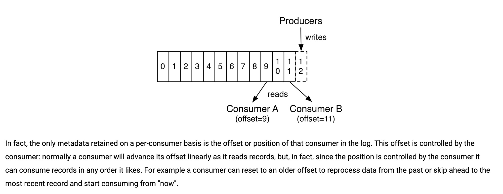

# kafka如何保证不丢消息

 2020-03-16 17:12:07

ps:这篇文章自我感觉说的很大白话了！希望你们看过了之后能有收获。

不了解 Kafka 的朋友建议先看一看我的下面这几篇文章，第一篇一定要看，其他的可以按需学习。

1. [入门篇！大白话带你认识 Kafka！](https://mp.weixin.qq.com/s?__biz=Mzg2OTA0Njk0OA==&mid=2247486230&idx=1&sn=24726ec0e0aac72b184023e0bb36e6d0&chksm=cea244ddf9d5cdcb124ec859de6f01f641919124ca50c3a9026a6367334e29faa5d1ebe450b3&token=820400845&lang=zh_CN&scene=21#wechat_redirect)
2. [5分钟带你体验一把 Kafka](http://mp.weixin.qq.com/s?__biz=Mzg2OTA0Njk0OA==&mid=2247486260&idx=2&sn=9b99125124d4fa1c342c1a9540845ba0&chksm=cea244fff9d5cde9be804d6a6709db4f628b963ac3443c2b98ec8beef32aea43115b8e038458&scene=21#wechat_redirect)
3. [Kafka系列第三篇！10 分钟学会如何在 Spring Boot 程序中使用 Kafka 作为消息队列?](https://mp.weixin.qq.com/s?__biz=Mzg2OTA0Njk0OA==&mid=2247486269&idx=2&sn=ec00417ad641dd8c3d145d74cafa09ce&chksm=cea244f6f9d5cde0c8eb233fcc4cf82e11acd06446719a7af55230649863a3ddd95f78d111de&token=1633957262&lang=zh_CN#rd)

### 生产者丢失消息的情况

生产者(Producer) 调用`send`方法发送消息之后，消息可能因为网络问题并没有发送过去。

所以，我们不能默认在调用`send`方法发送消息之后消息消息发送成功了。为了确定消息是发送成功，我们要判断消息发送的结果。但是要注意的是 Kafka 生产者(Producer) 使用 `send` 方法发送消息实际上是异步的操作，我们可以通过 `get()`方法获取调用结果，但是这样也让它变为了同步操作，示例代码如下：

> **详细代码见我的这篇文章：[Kafka系列第三篇！10 分钟学会如何在 Spring Boot 程序中使用 Kafka 作为消息队列?](https://mp.weixin.qq.com/s?__biz=Mzg2OTA0Njk0OA==&mid=2247486269&idx=2&sn=ec00417ad641dd8c3d145d74cafa09ce&chksm=cea244f6f9d5cde0c8eb233fcc4cf82e11acd06446719a7af55230649863a3ddd95f78d111de&token=1633957262&lang=zh_CN#rd)**

```java
SendResult<String, Object> sendResult = kafkaTemplate.send(topic, o).get();
if (sendResult.getRecordMetadata() != null) {
  logger.info("生产者成功发送消息到" + sendResult.getProducerRecord().topic() + "-> " + sendRe
              sult.getProducerRecord().value().toString());
}
```

但是一般不推荐这么做！可以采用为其添加回调函数的形式，示例代码如下：

```java
        ListenableFuture<SendResult<String, Object>> future = kafkaTemplate.send(topic, o);
        future.addCallback(result -> logger.info("生产者成功发送消息到topic:{} partition:{}的消息", result.getRecordMetadata().topic(), result.getRecordMetadata().partition()),
                ex -> logger.error("生产者发送消失败，原因：{}", ex.getMessage()));12
```

如果消息发送失败的话，我们检查失败的原因之后重新发送即可！

**另外这里推荐为 Producer 的`retries`（重试次数）设置一个比较合理的值，一般是 3 ，但是为了保证消息不丢失的话一般会设置比较大一点。设置完成之后，当出现网络问题之后能够自动重试消息发送，避免消息丢失。另外，建议还要设置重试间隔，因为间隔太小的话重试的效果就不明显了，网络波动一次你3次一下子就重试完了**

### 消费者丢失消息的情况

我们知道消息在被追加到 Partition(分区)的时候都会分配一个特定的偏移量（offset）。偏移量（offset)表示 Consumer 当前消费到的 Partition(分区)的所在的位置。Kafka 通过偏移量（offset）可以保证消息在分区内的顺序性。



当消费者拉取到了分区的某个消息之后，消费者会自动提交了 offset。自动提交的话会有一个问题，试想一下，当消费者刚拿到这个消息准备进行真正消费的时候，突然挂掉了，消息实际上并没有被消费，但是 offset 却被自动提交了。

**解决办法也比较粗暴，我们手动关闭闭自动提交 offset，每次在真正消费完消息之后之后再自己手动提交 offset 。** 但是，细心的朋友一定会发现，这样会带来消息被重新消费的问题。比如你刚刚消费完消息之后，还没提交 offset，结果自己挂掉了，那么这个消息理论上就会被消费两次。

### Kafka 弄丢了消息

我们知道 Kafka 为分区（Partition）引入了多副本（Replica）机制。分区（Partition）中的多个副本之间会有一个叫做 leader 的家伙，其他副本称为 follower。我们发送的消息会被发送到 leader 副本，然后 follower 副本才能从 leader 副本中拉取消息进行同步。生产者和消费者只与 leader 副本交互。你可以理解为其他副本只是 leader 副本的拷贝，它们的存在只是为了保证消息存储的安全性。

**试想一种情况：假如 leader 副本所在的 broker 突然挂掉，那么就要从 follower 副本重新选出一个 leader ，但是 leader 的数据还有一些没有被 follower 副本的同步的话，就会造成消息丢失。**

#### 设置 acks = all

解决办法就是我们设置 **acks = all**。acks 是 Kafka 生产者(Producer) 很重要的一个参数。

acks 的默认值即为1，代表我们的消息被leader副本接收之后就算被成功发送。当我们配置 **acks = all** 代表则所有副本都要接收到该消息之后该消息才算真正成功被发送。

#### 设置 replication.factor >= 3

为了保证 leader 副本能有 follower 副本能同步消息，我们一般会为 topic 设置 **replication.factor >= 3**。这样就可以保证每个 分区(partition) 至少有 3 个副本。虽然造成了数据冗余，但是带来了数据的安全性。

#### 设置 min.insync.replicas > 1

一般情况下我们还需要设置 **min.insync.replicas> 1** ，这样配置代表消息至少要被写入到 2 个副本才算是被成功发送。**min.insync.replicas** 的默认值为 1 ，在实际生产中应尽量避免默认值 1。

但是，为了保证整个 Kafka 服务的高可用性，你需要确保 **replication.factor > min.insync.replicas** 。为什么呢？设想一下加入两者相等的话，只要是有一个副本挂掉，整个分区就无法正常工作了。这明显违反高可用性！一般推荐设置成 **replication.factor = min.insync.replicas + 1**。

#### 设置 unclean.leader.election.enable = false

> **Kafka 0.11.0.0版本开始 unclean.leader.election.enable 参数的默认值由原来的true 改为false**

我们最开始也说了我们发送的消息会被发送到 leader 副本，然后 follower 副本才能从 leader 副本中拉取消息进行同步。多个 follower 副本之间的消息同步情况不一样，当我们配置了 **unclean.leader.election.enable = false** 的话，当 leader 副本发生故障时就不会从 follower 副本中和 leader 同步程度达不到要求的副本中选择出 leader ，这样降低了消息丢失的可能性。

### Reference

- Kafka 官方文档： https://kafka.apache.org/documentation/
- 极客时间—《Kafka核心技术与实战》第11节：无消息丢失配置怎么实现？

### 推荐阅读

[《70k Star Java开源项目出PDF阅读版本啦！》](http://mp.weixin.qq.com/s?__biz=Mzg2OTA0Njk0OA==&mid=2247486324&idx=1&sn=e8b690ddaedabc486bd399310105aad3&chksm=cea244bff9d5cda9a627fa65235be09e7b089e92cf49c0eb0ceb35b39bbed86c1fab0125f5af&token=1351080357&lang=zh_CN&scene=21#wechat_redirect) 。

**作者介绍:** Github 70k Star 项目 **[JavaGuide](https://github.com/Snailclimb/JavaGuide)**（公众号同名） 作者。每周都会在公众号更新一些自己原创干货。公众号后台回复“1”领取Java工程师必备学习资料+面试突击pdf。


[(23条消息) 面试官问我如何保证Kafka不丢失消息?我哭了！_不忘初心-CSDN博客_kafka保证消息不丢失](https://blog.csdn.net/qq_34337272/article/details/104903388)