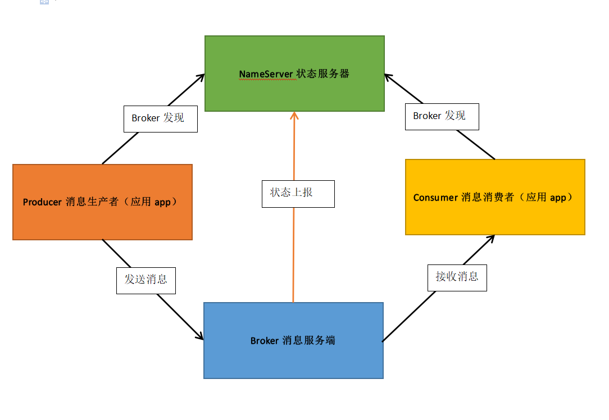

[TOC]


# 安装RocketMQ

By [SnoWalker](http://wuwenliang.net/about)

 发表于 2019-01-09

本文是“跟我学”系列的第一个系列–跟我学RocketMQ的第一篇，从本文开始，我将带领读者朋友们一起基于RocketMQ的最新稳定版4.3.2学习RocketMQ，从运维到开发全方位的角度去剖析这款高性能的分布式消息中间件。并将笔者在实践中的最佳实践一起分享给读者，话不多说，我们开始吧。

## 简介RocketMQ

开始之前我们简单了解下RocketMQ，明确一下为何要学习这款消息队列。

> RocketMQ是阿里巴巴开源，目前已经成为Apache顶级开源项目的分布式消息中间件。它具有高吞吐量、支持分布式事务、高可靠等特点。在阿里内部，支撑了包括双十一在内的各种大规模、高并发的分布式场景。它支持高可靠部署，值得企业进行大规模应用。使用Java语言开发，更有利于开发者进行源码的学习及二次开发。

为了贴近实战，我使用的部署环境为virualBox虚拟的centos7，开发环境为IDEA2018，JDK版本为**Java(TM) SE Runtime Environment (build 1.8.0_191-b12)**，关于如何安装jdk
不是本文的重点，在文章末尾会提供链接。所有的实验均是基于此环境进行的。

## 下载二进制文件

首先，远程到服务器，建立目录app，并在该目录下建立rocketmq目录，用于存放rocketmq的二进制文件及相关脚本。

```
# 建立文件夹app
mkdir /app
cd /app
# 建立文件夹rocketmq
mkdir rocketmq
cd rocketmq
```

首先，从官网下载最新的稳定版本的二进制文件，地址为：[下载地址](https://www.apache.org/dyn/closer.cgi?path=rocketmq/4.3.2/rocketmq-all-4.3.2-bin-release.zip)

使用wget进行下载，命令如下

```
wget https://www.apache.org/dyn/closer.cgi?path=rocketmq/4.3.2/rocketmq-all-4.3.2-bin-release.zip
```

如果没有wget命令，使用yum安装即可

```
yum -y install wget
```

## 解压二进制压缩包

下载到本地之后，解压zip包。

```
unzip rocketmq-all-4.3.2-bin-release.zip
```

为了方便我们直接将文件夹重命名为rocketmq

```
cp -r rocketmq-all-4.3.2-bin-release rocketmq
```

到这里，我们需要的二进制文件已经准备好了，首先来看下目录结构

```
[root@localhost rocketmq]# ll

drwxr-xr-x. 2 root root    83 Nov  5 16:46 benchmark     压测工具包
drwxr-xr-x. 2 root root  4096 Jan  9 18:12 bin           启动脚本等
drwxr-xr-x. 5 root root   158 Jan  9 18:19 conf          配置文件目录
drwxr-xr-x. 2 root root  4096 Nov  5 16:46 lib           rocketmq依赖的三方库和二方库
-rw-r--r--. 1 root root 17336 Nov  5 16:46 LICENSE       发行许可
-rw-r--r--. 1 root root  1337 Nov  5 16:46 NOTICE        
-rw-r--r--. 1 root root  2482 Nov  5 16:46 README.md
```

## 知识补充：RocketMQ架构

这里要讲解一个知识点，关于RocketMQ的架构。

如下图所示：

[](http://wuwenliang.net/2019/01/09/跟我学RocketMQ-1-1-之安装RocketMQ/construct.png)RocketMQ架构

从图中我们可以看出，RocketMQ的组成结构中，主要有四个角色：Nameserver、Broker、Producer、Consumer等。我们通过一个列表来宏观的了解下各个角色的特点。

| 角色名称   | 描述                    | 功能                                                         |
| :--------- | :---------------------- | :----------------------------------------------------------- |
| Nameserver | 状态服务器              | 整个消息队列中的状态服务器，RocketMQ服务端的主要组成部分之一，集群中各个组件通过它了解全局信息 |
| Broker     | 消息服务端              | 消息队列的服务端，主要进行消息存储，调度等功能。定期向NameServer上报自己的状态。 |
| Producer   | 消息生产者，（应用app） | 该角色一般需要开发，向Broker中发送消息。通过NameServer进行Broker的发现。 |
| Consumer   | 消息消费者，（应用app） | 该角色一般需要开发，从Broker中主动拉取（Pull）或者由Broker推送（Push）进行消息的消费操作。通过NameServer进行Broker的发现 |

这些角色均可以以集群的方式存在。其中，Nameserver与Broker的集群部署方式是整个消息服务高可用HA的保证。

## 启动消息服务端

了解了RocketMQ的主要角色之后，我们开始进行服务的部署工作。

### 修改配置文件

首先需要修改配置文件，如果使用默认配置文件，我们本地开发的服务是无法连接到broker的。

进入服务器目录/app/rocketmq/conf中，编辑文件broker.conf，（建议编辑之前先进行备份）。添加brokerIp及nameServerIp，这里以单模块方式进行配置，配置信息如下。

```properties
# 指定broker的ip为主网卡的地址
brokerIP1=172.30.83.100
brokerIP2=172.30.83.100
# 指定nameServer的地址
namesrvAddr=172.30.83.100:9876
# broker集群名称
brokerClusterName = DefaultCluster
# 当前broker名称，master和slave使用相同的broker名称表明相互关系
# 用来说明某个slave是那个master的slave
brokerName = broker-a
# 一个master broker可以有多个slave，0表示master，大于0表示不同slave的id
brokerId = 0
# 与fileReservedTime参数呼应，表明在几点做消息删除动作，默认值04表示凌晨4点
deleteWhen = 04
fileReservedTime = 48
# 表示当slave和master消息同步完成之后，再返回发送成功的状态
brokerRole = ASYNC_MASTER
# 刷盘策略，分为ASYNC_FLUSH和SYNC_FLUSH两种，分别代表异步刷盘和同步刷盘。
# 在同步刷盘情况下，消息真正写入磁盘之后再返回成功状态；
# 异步刷盘情况下，消息写入page_cache之后就返回成功状态
flushDiskType = ASYNC_FLUSH
# Broker监听的端口号，如果一台机器上启动了多个broker，则要设置不同的端口号，避免冲突
listenPort=10911
# 存储消息及一些配置信息的根目录
storePathRootDir=/home/rocketmq/store-a
```

**注意**

> 上述配置在Broker启动的时候生效，如果启动后发生变更，要重启Broker。

brokerIP1 当前broker监听的IP

brokerIP2 存在broker主从时，在broker主节点上配置了brokerIP2的话,broker从节点会连接主节点配置的brokerIP2来同步。

默认不配置brokerIP1和brokerIP2时，都会根据当前网卡选择一个IP使用，当你的机器有多块网卡时，很有可能会有问题。比如，我遇到的问题是我机器上有两个IP，一个公网IP，一个私网IP，结果默认选择的走公网IP，这是不正确的，我期望的是所有业务内部通信都走内网。

每个配置的含义均添加了注释，我就不再重复了。这里要注意，由于我们的nameserver和broker均在同一台主机部署，因此要直接显式指定ip为linux主机的ip，不指定的话，启动会使用默认配置，其中 brokerip1 的值默认是本机IP地址，默认系统自动识别，但是某些多网卡机器会存在识别错误的情况。所以该值需要手动配置。

否则rocketmq会加载内网ip导致我们的开发环境和服务器不在同一个网段而造成消息无法投递。

### 调整内存大小

在正式启动之前需要调整默认的启动内存配置，否则会因为内存不足而报错，具体的启动参数以机器配置为准。

#### 修改nameserver启动内存配置

编辑启动脚本

```
[root@localhost bin]# vi runserver.sh 
```

修改如下参数，这里我设置最大内存与最小内存为4g

```
#===========================================================================================
# JVM Configuration
#===========================================================================================
JAVA_OPT="${JAVA_OPT} -server -Xms4g -Xmx4g -Xmn2g -XX:MetaspaceSize=128m -XX:MaxMetaspaceSize=320m"
```

**注意** 内存配置需要根据自身PC内存的可用容量动态设置，建议-Xms，-Xmx保持一致，设置为物理内存的1/8以上。（物理内存至少设置为8G以上）

#### 修改broker启动内存配置

相同的方式编辑broker启动脚本

```
[root@localhost bin]# vi runbroker.sh 
```

修改内存配置，设置最大内存与最小内存为2g，具体配置看你的机器配置

```
#===========================================================================================
# JVM Configuration
#===========================================================================================
JAVA_OPT="${JAVA_OPT} -server -Xms2g -Xmx2g -Xmn4g"
```

**注意** 内存配置需要根据自身PC内存的可用容量动态设置，建议-Xms，-Xmx保持一致，设置为物理内存的1/8以上。（物理内存至少设置为8G以上）

### 启动nameServer

启动脚本及配置文件修改完成之后保存，接着启动nameServer

```
cd /app/rocketmq
nohup sh bin/mqnamesrv &
```

查看启动日志如下，默认路径为 **~/logs/rocketmqlogs/namesev.log**

[](http://wuwenliang.net/2019/01/09/跟我学RocketMQ-1-1-之安装RocketMQ/nameserver-succ.png)nameserver启动成功日志

### 启动broker

nameserver启动完成之后，接着启动broker

```
使用配置文件方式启动broker 
# nohup sh bin/mqbroker -c conf/broker.conf  &
```

这里我们显式指定启动要加载的配置文件。保证外部应用能够访问到当前的rocketmq服务。

查看启动日志如下，默认路径为 **~/logs/rocketmqlogs/broker.log**，表明启动成功

[](http://wuwenliang.net/2019/01/09/跟我学RocketMQ-1-1-之安装RocketMQ/broker-succ.png)broker启动成功日志

### 关闭宿主机防火墙

为了方便外部应用进行连接，将宿主机的防火墙关闭，直接执行firewall命令即可：

```
启动： systemctl start firewalld
关闭： systemctl stop firewalld
查看状态： systemctl status firewalld 
开机禁用  ： systemctl disable firewalld
开机启用  ： systemctl enable firewalld
```

关闭防火墙后，应用连接rocketmq就基本不会报 **org.apache.rocketmq.client.exception.MQClientException**异常。

到这里我们就搭建完成单机模式的rocketmq，并能基于它进行开发工作了。集群模式的将在后续的运维篇中进行展开讲解。

## 附录1：关键指令

```sh
启动nameserver  
nohup sh bin/mqnamesrv &

启动broker
nohup sh bin/mqbroker -n localhost:9876 &

关闭nameserver
sh bin/mqshutdown namesrv
关闭broker
sh bin/mqshutdown broker

使用配置文件方式启动broker 
nohup sh bin/mqbroker -c conf/broker.conf  &
```

## 附录2：参考资料

[解决：org.apache.rocketmq.client.exception.MQClientException: No route info of this topic, TopicTest](https://blog.csdn.net/jiangyu1013/article/details/81478754)

[删掉centos原有的openjdk并安装sun jdk](https://www.cnblogs.com/java-zhao/p/6016469.html)

[Centos7安装JDK8以及环境配置](https://blog.csdn.net/pang_ping/article/details/80570011)

[jdk8官方下载地址](https://www.oracle.com/technetwork/java/javase/downloads/jdk8-downloads-2133151.html)

[rocketMq排坑：如何设置rocketMq broker的ip地址](http://www.bubuko.com/infodetail-2087825.html)

[CentOS7使用firewalld打开关闭防火墙与端口](https://www.cnblogs.com/moxiaoan/p/5683743.html)

《RocketMQ实战与原理解析》


------


http://wuwenliang.net/2019/01/09/%E8%B7%9F%E6%88%91%E5%AD%A6RocketMQ-1-1-%E4%B9%8B%E5%AE%89%E8%A3%85RocketMQ/