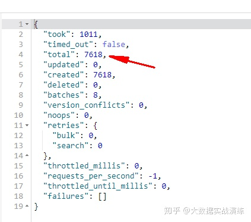
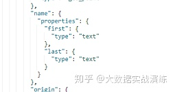
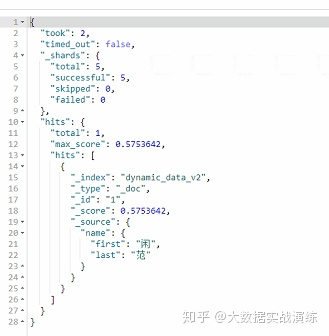

# Elasticsearch如何修改Mapping结构并实现业务零停机

Elasticsearch 版本：6.4.0

## 一、疑问

在项目中后期，如果想调整索引的 Mapping 结构，比如将 **ik_smart 修改为 ik_max_word** 或者 **增加分片数量** 等，但 Elasticsearch 不允许这样修改呀，怎么办？

**常规**解决方法：

- 根据最新的 Mapping 结构再创建一个索引
- 将旧索引的数据全量导入到新索引中
- 告知用户，业务要暂停使用一段时间
- 修改程序，将索引名替换成新的索引名称，打包，重新上线
- 告知用户，服务可以继续使用了，并说一声抱歉

我认为最大的弊端就是：**需要修改替换程序，甚至有时候还得告知用户暂停使用业务**。

有没有更好的方式去解决上面的需求呢？有！幸好，Elasticsearch 为我们提供了另外一种解决方法，可以**不需要告知用户和修改程序代码。那就是通过索引别名来重建索引**。

## 二、索引别名

索引别名可以关联一个或多个索引，并且可以在任何需要索引名称的 API 中使用。 通俗解释，别名类似于 windows 的快捷方式，linux 的软链接，mysql 的视图。别名为我们提供了极大的灵活性。它们允许我们执行以下操作：

- 在正在运行的集群上，允许一个索引与另外一个索引之间透明切换。
- 对多个索引进行分组组合。比如，有根据月份来创建的索引，别名可与近三个月的索引进行关联。这样的话，我们就可以通过 **别名** 来 **查询近三个月索引** 的全部数据。如果别名用得好，可以**更好地控制检索数据量的大小，来提高查询效率**，但这也需要经验的积累。

本文开头遇到的问题，就可以通过索引别名来实现，现在我们学习一下具体操作。

## 三、具体操作

如何在零停机（该索引所用到的程序不停止运行）的前提下，修改索引的 Mapping 字段类型呢？可大体分为三步：

### 1、步骤一：复制数据

使用 reindex 操作来将旧索引（dynamic_data_v2）的数据完全复制到新索引（dynamic_data_v5）上：

```sh
POST _reindex
{
    "source": {
        "index": "dynamic_data_v2"
    },
    "dest": {
        "index": "dynamic_data_v5"
    }
}
```

执行结果：





### 2、步骤二：修改别名关联

```sh
POST /_aliases
{
    "actions": [
        { "remove": { "index": "dynamic_data_v2", "alias": "dynamic_data" }},
        { "add":    { "index": "dynamic_data_v5", "alias": "dynamic_data" }}
    ]
}
```

### 3、步骤三：删除旧索引（可选）

```text
DELETE dynamic_data_v2
```

### 4、小结

至此，我们达到了伪更新（对于用户来说透明化，无需停止服务）的效果。不过这里存在一个问题，如果数据量超大的话，复制数据所消费的时间比较多，所以构建索引前还是要尽量考虑周全 mapping 结构。

关于索引别名更多操作，可参考：

[https://www.elastic.co/guide/en/elasticsearch/reference/6.4/indices-aliases.html](https://link.zhihu.com/?target=https%3A//www.elastic.co/guide/en/elasticsearch/reference/6.4/indices-aliases.html)

## 四、可修改 mapping 的个别情况

Elasticsearch 不允许修改/删除 Mapping 已存在字段是因为：其底层使用的是 lucene 库，索引和搜索要涉及分词方式等操作，更改 Mapping 将意味着使已建立索引的文档失效，所以不允许修改 已存在字段类型等设置。

但也有个别情况：Elasticsearch 允许我们 将字段**添加**到索引现有的 Mapping 结构中 或 更改现有字段的**仅搜索**设置。

### 1、可以新增字段

```text
POST dynamic_data_v2/_mapping/_doc
{
  "properties": {
     "amount":{
        "type":"text"
     }
  }
}
```

### 2、可以更改字段类型为 multi_field

```text
PUT dynamic_data_v2/_mapping/_doc
{
  "properties": {
     "amount":{
        "type":"text",
        "fields": {
          "keyword": {
            "type": "keyword",
            "ignore_above": 10
          }
        }
     }
  }
}
# 为 amount 增加 multi_field
# "fields": {
#    "keyword": {
#       "type": "keyword",
#       "ignore_above": 10
#    }
# }
```

### 3、可以将新 properties 添加到 “对象” 数据类型字段。

在 Mapping 的 field 里面设置 properties ，可以使字段存储 Object 的数据类型。以下的 name 可以理解为 “对象”数据类型字段：

```text
# 新增 name 字段，附带first的properties属性
PUT dynamic_data_v2/_mapping/_doc
{
  "properties": {
     "name":{
        "properties": {
            "first": {
              "type": "text"
            }
        }
     }
  }
}
# 可以支持继续新增一个名为last的properties属性
PUT dynamic_data_v2/_mapping/_doc
{
  "properties": {
     "name":{
        "properties": {
            "last": {
              "type": "text"
            }
        }
     }
  }
}
```

如下图所示：





存储数据：

```text
# name 的对象里面有两个字段，分别为：first 和 last，代表名和姓，比如“范闲”。
PUT dynamic_data_v2/_doc/1
{
  "name": {
    "first": "闲",
    "last": "范"
  }
}
```

查询数据：

```text
GET dynamic_data_v2/_search
{
  "query": {
    "bool": {
      "must": [
        {
          "match_phrase": {
            "name.last": "范"
          }
        },
        {
          "match_phrase": {
            "name.first": "闲"
          }
        }
      ]
    }
  }
}
```

返回结果：





上述三种方式，详情可参考：

[https://www.elastic.co/guide/en/elasticsearch/reference/6.4/indices-put-mapping.html#updating-field-mappings](https://link.zhihu.com/?target=https%3A//www.elastic.co/guide/en/elasticsearch/reference/6.4/indices-put-mapping.html%23updating-field-mappings)

## 五、总结

别名是个好东西，而索引别名只是别名的其中一个类型。一般在项目中后期，索引中有大量数据的时候，才能体会到索引别名的妙用。正如本文提及：

- 用户无感知地维护数据修改更新。
- 索引组合查询，如果使用得当，可以实现精准快速查询，提高效率。

**建议：**相同索引别名的物理索引有 **一致的 Mapping 和 数据结构** ，以提升检索效率。


[Elasticsearch如何修改Mapping结构并实现业务零停机 - 知乎 (zhihu.com)](https://zhuanlan.zhihu.com/p/104462527)