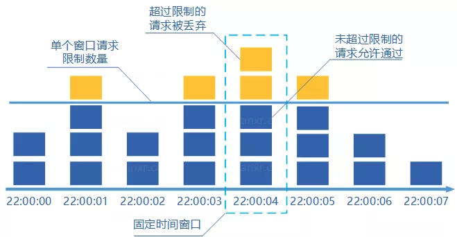
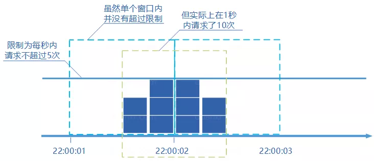

# 接口限流看这一篇就够了-redis实现分布式限流


## 导读

- 前几天和一个朋友讨论了他们公司的系统问题，传统的单体应用，集群部署，他说近期服务的并发量可能会出现瞬时增加的风险，虽然部署了集群，但是通过压测后发现请求延迟仍然是很大，想问问我有什么改进的地方。我沉思了一会，现在去改架构显然是不可能的，于是我给出了一个建议，让他去做个接口限流，这样能够保证瞬时并发量飙高也不会出现请求延迟的问题，用户的体验度也会上去。
- 至于什么是接口限流？怎么实现接口限流？如何实现单机应用的限流？如何实现分布式应用的限流？本篇文章将会详细阐述。

## 限流的常见几种算法

- 常见的限流算法有很多，但是最常用的算法无非以下四种。

### 固定窗口计数器



- 固定算法的概念如下

1. 将时间划分为多个窗口
2. 在每个窗口内每有一次请求就将计数器加一
3. 如果计数器超过了限制数量，则本窗口内所有的请求都被丢弃当时间到达下一个窗口时，计数器重置。

- 固定窗口计数器是最为简单的算法，但这个算法有时会让通过请求量允许为限制的两倍。考虑如下情况：限制 1 秒内最多通过 5 个请求，在第一个窗口的最后半秒内通过了 5 个请求，第二个窗口的前半秒内又通过了 5 个请求。这样看来就是在 1 秒内通过了 10 个请求。



### 滑动窗口计数器


- 滑动窗口计数器算法概念如下：

1. 将时间划分为多个区间；
2. 在每个区间内每有一次请求就将计数器加一维持一个时间窗口，占据多个区间；
3. 每经过一个区间的时间，则抛弃最老的一个区间，并纳入最新的一个区间；
4. 如果当前窗口内区间的请求计数总和超过了限制数量，则本窗口内所有的请求都被丢弃。

- 滑动窗口计数器是通过将窗口再细分，并且按照时间 " 滑动 "，这种算法避免了固定窗口计数器带来的双倍突发请求，但时间区间的精度越高，算法所需的空间容量就越大。

### 漏桶算法


- 漏桶算法概念如下：

1. 将每个请求视作 " 水滴 " 放入 " 漏桶 " 进行存储；
2. “漏桶 " 以固定速率向外 " 漏 " 出请求来执行如果 " 漏桶 " 空了则停止 " 漏水”；
3. 如果 " 漏桶 " 满了则多余的 " 水滴 " 会被直接丢弃。

- 漏桶算法多使用队列实现，服务的请求会存到队列中，服务的提供方则按照固定的速率从队列中取出请求并执行，过多的请求则放在队列中排队或直接拒绝。
- 漏桶算法的缺陷也很明显，当短时间内有大量的突发请求时，即便此时服务器没有任何负载，每个请求也都得在队列中等待一段时间才能被响应。

### 令牌桶算法


- 令牌桶算法概念如下：

1. 令牌以固定速率生成。
2. 生成的令牌放入令牌桶中存放，如果令牌桶满了则多余的令牌会直接丢弃，当请求到达时，会尝试从令牌桶中取令牌，取到了令牌的请求可以执行。
3. 如果桶空了，那么尝试取令牌的请求会被直接丢弃。

- 令牌桶算法既能够将所有的请求平均分布到时间区间内，又能接受服务器能够承受范围内的突发请求，因此是目前使用较为广泛的一种限流算法。

## 单体应用实现

- 在传统的单体应用中限流只需要考虑到多线程即可，使用Google开源工具类guava即可。其中有一个RateLimiter专门实现了单体应用的限流，使用的是令牌桶算法。
- 单体应用的限流不是本文的重点，官网上现成的API，读者自己去看看即可，这里不再详细解释。

## 分布式限流

- 分布式限流和熔断现在有很多的现成的工具，比如Hystrix，Sentinel 等，但是还是有些企业不引用外来类库，因此就需要自己实现。
- Redis作为单线程多路复用的特性，很显然能够胜任这项任务。

### Redis如何实现

- 使用令牌桶的算法实现，根据前面的介绍，我们了解到令牌桶算法的基础需要两个个变量，分别是桶容量，产生令牌的速率。
- 这里我们实现的就是每秒产生的速率加上一个桶容量。但是如何实现呢？这里有几个问题。
- 需要保存什么数据在redis中？
  - 当前桶的容量，最新的请求时间
- 以什么数据结构存储？
  - 因为是针对接口限流，每个接口的业务逻辑不同，对并发的处理也是不同，因此要细化到每个接口的限流，此时我们选用HashMap的结构，hashKey是接口的唯一id，可以是请求的uri，里面的分别存储当前桶的容量和最新的请求时间。
- 如何计算需要放令牌？
  - 根据redis保存的上次的请求时间和当前时间比较，如果相差大于的**产生令牌的时间（陈某实现的是1秒）**则再次产生令牌，此时的桶容量为当前令牌+产生的令牌
- 如何保证redis的原子性？
  - 保证redis的原子性，使用lua脚本即可解决。
- 有了上述的几个问题，便能很容易的实现。

### 开撸

1、lua脚本如下：

```lua
local ratelimit_info = redis.pcall('HMGET',KEYS[1],'last_time','current_token')
local last_time = ratelimit_info[1]
local current_token = tonumber(ratelimit_info[2])
local max_token = tonumber(ARGV[1])
local token_rate = tonumber(ARGV[2])
local current_time = tonumber(ARGV[3])
if current_token == nil then
  current_token = max_token
  last_time = current_time
else
  local past_time = current_time-last_time
  
  if past_time>1000 then
	  current_token = current_token+token_rate
	  last_time = current_time
  end

  ## 防止溢出
  if current_token>max_token then
    current_token = max_token
	last_time = current_time
  end
end

local result = 0
if(current_token>0) then
  result = 1
  current_token = current_token-1
  last_time = current_time
end
redis.call('HMSET',KEYS[1],'last_time',last_time,'current_token',current_token)
return result
```

- 调用lua脚本出四个参数，分别是接口方法唯一id，桶容量，每秒产生令牌的数量，当前请求的时间戳。

2、 SpringBoot代码实现

- 采用Spring-data-redis实现lua脚本的执行。
- Redis序列化配置：

```java
 /**
     * 重新注入模板
     */
    @Bean(value = "redisTemplate")
    @Primary
    public RedisTemplate redisTemplate(RedisConnectionFactory redisConnectionFactory){
        RedisTemplate<String, Object> template = new RedisTemplate<>();
        template.setConnectionFactory(redisConnectionFactory);
        ObjectMapper objectMapper = new ObjectMapper();
        objectMapper.setSerializationInclusion(JsonInclude.Include.NON_NULL);
        objectMapper.enableDefaultTyping(ObjectMapper.DefaultTyping.NON_FINAL);
        //设置序列化方式，key设置string 方式，value设置成json
        StringRedisSerializer stringRedisSerializer = new StringRedisSerializer();
        Jackson2JsonRedisSerializer jsonRedisSerializer = new Jackson2JsonRedisSerializer(Object.class);
        jsonRedisSerializer.setObjectMapper(objectMapper);
        template.setEnableDefaultSerializer(false);
        template.setKeySerializer(stringRedisSerializer);
        template.setHashKeySerializer(stringRedisSerializer);
        template.setValueSerializer(jsonRedisSerializer);
        template.setHashValueSerializer(jsonRedisSerializer);
        return template;
    }
```

- 限流工具类

```java
/**
 * @Description 限流工具类
 * @Author CJB
 * @Date 2020/3/19 17:21
 */
public class RedisLimiterUtils {

    private static StringRedisTemplate stringRedisTemplate=ApplicationContextUtils.applicationContext.getBean(StringRedisTemplate.class);

    /**
     * lua脚本，限流
     */
    private final static String TEXT="local ratelimit_info = redis.pcall('HMGET',KEYS[1],'last_time','current_token')\n" +
            "local last_time = ratelimit_info[1]\n" +
            "local current_token = tonumber(ratelimit_info[2])\n" +
            "local max_token = tonumber(ARGV[1])\n" +
            "local token_rate = tonumber(ARGV[2])\n" +
            "local current_time = tonumber(ARGV[3])\n" +
            "if current_token == nil then\n" +
            "  current_token = max_token\n" +
            "  last_time = current_time\n" +
            "else\n" +
            "  local past_time = current_time-last_time\n" +
            "  \n" +
            "  if past_time>1000 then\n" +
            "\t  current_token = current_token+token_rate\n" +
            "\t  last_time = current_time\n" +
            "  end\n" +
            "\n" +
            "  if current_token>max_token then\n" +
            "    current_token = max_token\n" +
            "\tlast_time = current_time\n" +
            "  end\n" +
            "end\n" +
            "\n" +
            "local result = 0\n" +
            "if(current_token>0) then\n" +
            "  result = 1\n" +
            "  current_token = current_token-1\n" +
            "  last_time = current_time\n" +
            "end\n" +
            "redis.call('HMSET',KEYS[1],'last_time',last_time,'current_token',current_token)\n" +
            "return result";


    /**
     * 获取令牌
     * @param key 请求id
     * @param max 最大能同时承受多少的并发（桶容量）
     * @param rate  每秒生成多少的令牌
     * @return 获取令牌返回true，没有获取返回false
     */
    public static boolean tryAcquire(String key, int max,int rate) {
        List<String> keyList = new ArrayList<>(1);
        keyList.add(key);
        DefaultRedisScript<Long> script = new DefaultRedisScript<>();
        script.setResultType(Long.class);
        script.setScriptText(TEXT);
        return Long.valueOf(1).equals(stringRedisTemplate.execute(script,keyList,Integer.toString(max), Integer.toString(rate),
                Long.toString(System.currentTimeMillis())));
    }
}
```

- 采用拦截器+注解的方式实现，注解如下：

```java
/**
 * @Description 限流的注解，标注在类上或者方法上。在方法上的注解会覆盖类上的注解，同@Transactional
 * @Author CJB
 * @Date 2020/3/20 13:36
 */
@Inherited
@Target({ElementType.TYPE, ElementType.METHOD})
@Retention(RetentionPolicy.RUNTIME)
public @interface RateLimit {
    /**
     * 令牌桶的容量，默认100
     * @return
     */
    int capacity() default 100;

    /**
     * 每秒钟默认产生令牌数量，默认10个
     * @return
     */
    int rate() default 10;
}
```

- 拦截器如下：

```java
/**
 * @Description 限流的拦器
 * @Author CJB
 * @Date 2020/3/19 14:34
 */
@Component
public class RateLimiterIntercept implements HandlerInterceptor {
    @Override
    public boolean preHandle(HttpServletRequest request, HttpServletResponse response, Object handler) throws Exception {
        if (handler instanceof HandlerMethod){
            HandlerMethod handlerMethod=(HandlerMethod)handler;
            Method method = handlerMethod.getMethod();
            /**
             * 首先获取方法上的注解
             */
            RateLimit rateLimit = AnnotationUtils.findAnnotation(method, RateLimit.class);
            //方法上没有标注该注解，尝试获取类上的注解
            if (Objects.isNull(rateLimit)){
                //获取类上的注解
                rateLimit = AnnotationUtils.findAnnotation(handlerMethod.getBean().getClass(), RateLimit.class);
            }

            //没有标注注解，放行
            if (Objects.isNull(rateLimit))
                return true;

            //尝试获取令牌，如果没有令牌了
            if (!RedisLimiterUtils.tryAcquire(request.getRequestURI(),rateLimit.capacity(),rateLimit.rate())){
                //抛出请求超时的异常
                throw new  TimeOutException();
            }
        }
        return true;
    }
}
```

- SpringBoot配置拦截器的代码就不贴了，以上就是完整的代码，至此分布式限流就完成了。
- 

D:\backup\studio\AvailableCode\database\NoSQL\cache-缓存\redis\redistemplate-redisson-分布式锁\spring-boot-redistemplate RedisRateLimiterUtilTest


https://www.cnblogs.com/Chenjiabing/p/12534346.html