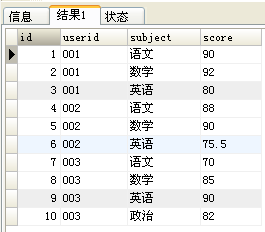
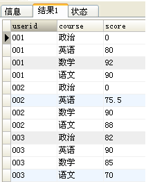

# mysql 行转列 列转行

## 一、行转列

**即将原本同一列下多行的不同内容作为多个字段，输出对应内容。**

建表语句

```sql
DROP TABLE IF EXISTS tb_score;

CREATE TABLE tb_score(
    id INT(11) NOT NULL auto_increment,
    userid VARCHAR(20) NOT NULL COMMENT '用户id',
    subject VARCHAR(20) COMMENT '科目',
    score DOUBLE COMMENT '成绩',
    PRIMARY KEY(id)
)ENGINE = INNODB DEFAULT CHARSET = utf8;
```

插入数据

```
INSERT INTO tb_score(userid,subject,score) VALUES ('001','语文',90);
INSERT INTO tb_score(userid,subject,score) VALUES ('001','数学',92);
INSERT INTO tb_score(userid,subject,score) VALUES ('001','英语',80);
INSERT INTO tb_score(userid,subject,score) VALUES ('002','语文',88);
INSERT INTO tb_score(userid,subject,score) VALUES ('002','数学',90);
INSERT INTO tb_score(userid,subject,score) VALUES ('002','英语',75.5);
INSERT INTO tb_score(userid,subject,score) VALUES ('003','语文',70);
INSERT INTO tb_score(userid,subject,score) VALUES ('003','数学',85);
INSERT INTO tb_score(userid,subject,score) VALUES ('003','英语',90);
INSERT INTO tb_score(userid,subject,score) VALUES ('003','政治',82);
```

查询数据表中的内容（即转换前的结果）

```
SELECT * FROM tb_score
```



先来看一下转换后的结果：

****

可以看出，这里行转列是将原来的subject字段的多行内容选出来，作为结果集中的不同列，并根据userid进行分组显示对应的score。

### 1、使用case...when....then 进行行转列

```
SELECT userid,
SUM(CASE `subject` WHEN '语文' THEN score ELSE 0 END) as '语文',
SUM(CASE `subject` WHEN '数学' THEN score ELSE 0 END) as '数学',
SUM(CASE `subject` WHEN '英语' THEN score ELSE 0 END) as '英语',
SUM(CASE `subject` WHEN '政治' THEN score ELSE 0 END) as '政治' 
FROM tb_score 
GROUP BY userid
```

### 2、使用IF() 进行行转列：

```
SELECT userid,
SUM(IF(`subject`='语文',score,0)) as '语文',
SUM(IF(`subject`='数学',score,0)) as '数学',
SUM(IF(`subject`='英语',score,0)) as '英语',
SUM(IF(`subject`='政治',score,0)) as '政治' 
FROM tb_score 
GROUP BY userid
```

注意点：

（1）SUM() 是为了能够使用GROUP BY根据userid进行分组，因为每一个userid对应的subject="语文"的记录只有一条，所以SUM() 的值就等于对应那一条记录的score的值。

假如userid ='001' and subject='语文' 的记录有两条，则此时SUM() 的值将会是这两条记录的和，同理，使用Max()的值将会是这两条记录里面值最大的一个。但是正常情况下，一个user对应一个subject只有一个分数，因此可以使用SUM()、MAX()、MIN()、AVG()等聚合函数都可以达到行转列的效果。

（2）IF(`subject`='语文',score,0) 作为条件，即对所有subject='语文'的记录的score字段进行SUM()、MAX()、MIN()、AVG()操作，如果score没有值则默认为0。

### 3、利用SUM(IF()) 生成列 + WITH ROLLUP 生成汇总行,并利用 IFNULL将汇总行标题显示为Total

```
SELECT IFNULL(userid,'total') AS userid,
SUM(IF(`subject`='语文',score,0)) AS 语文,
SUM(IF(`subject`='数学',score,0)) AS 数学,
SUM(IF(`subject`='英语',score,0)) AS 英语,
SUM(IF(`subject`='政治',score,0)) AS 政治,
SUM(IF(`subject`='total',score,0)) AS total
FROM(
    SELECT userid,IFNULL(`subject`,'total') AS `subject`,SUM(score) AS score
    FROM tb_score
    GROUP BY userid,`subject`
    WITH ROLLUP
    HAVING userid IS NOT NULL
)AS A 
GROUP BY userid
WITH ROLLUP;
```

运行结果


### 4、利用SUM(IF()) 生成列 + UNION 生成汇总行,并利用 IFNULL将汇总行标题显示为 Total

```
SELECT userid,
SUM(IF(`subject`='语文',score,0)) AS 语文,
SUM(IF(`subject`='数学',score,0)) AS 数学,
SUM(IF(`subject`='英语',score,0)) AS 英语,
SUM(IF(`subject`='政治',score,0)) AS 政治,
SUM(score) AS TOTAL 
FROM tb_score
GROUP BY userid
UNION
SELECT 'TOTAL',SUM(IF(`subject`='语文',score,0)) AS 语文,
SUM(IF(`subject`='数学',score,0)) AS 数学,
SUM(IF(`subject`='英语',score,0)) AS 英语,
SUM(IF(`subject`='政治',score,0)) AS 政治,
SUM(score) FROM tb_score
```


运行结果：


### **5、利用SUM(IF()) 生成列，直接生成结果不再利用子查询**

```
SELECT IFNULL(userid,'TOTAL') AS userid,
SUM(IF(`subject`='语文',score,0)) AS 语文,
SUM(IF(`subject`='数学',score,0)) AS 数学,
SUM(IF(`subject`='英语',score,0)) AS 英语,
SUM(IF(`subject`='政治',score,0)) AS 政治,
SUM(score) AS TOTAL 
FROM tb_score
GROUP BY userid WITH ROLLUP;
```


运行结果：


### **6、动态，适用于列不确定情况**

```
SET @EE='';
select @EE :=CONCAT(@EE,'sum(if(subject= \'',subject,'\',score,0)) as ',subject, ',') AS aa FROM (SELECT DISTINCT subject FROM tb_score) A ;

SET @QQ = CONCAT('select ifnull(userid,\'TOTAL\')as userid,',@EE,' sum(score) as TOTAL from tb_score group by userid WITH ROLLUP');
-- SELECT @QQ;

PREPARE stmt FROM @QQ;
EXECUTE stmt;
DEALLOCATE PREPARE stmt;
```


运行结果：


### **7、合并字段显示：利用group_concat()**

```
SELECT userid,GROUP_CONCAT(`subject`,":",score)AS 成绩 FROM tb_score
GROUP BY userid
```

运行结果：


```
group_concat()，手册上说明:该函数返回带有来自一个组的连接的非NULL值的字符串结果。比较抽象，难以理解。通俗点理解，其实是这样的：group_concat()会计算哪些行属于同一组，将属于同一组的列显示出来。要返回哪些列，由函数参数(就是字段名)决定。分组必须有个标准，就是根据group by指定的列进行分组。
```

结论：group_concat()函数可以很好的建属于同一分组的多个行转化为一个列。

## 二、列转行

建表语句：

```
CREATE TABLE tb_score1(
    id INT(11) NOT NULL auto_increment,
    userid VARCHAR(20) NOT NULL COMMENT '用户id',
    cn_score DOUBLE COMMENT '语文成绩',
    math_score DOUBLE COMMENT '数学成绩',
    en_score DOUBLE COMMENT '英语成绩',
    po_score DOUBLE COMMENT '政治成绩',
    PRIMARY KEY(id)
)ENGINE = INNODB DEFAULT CHARSET = utf8;
```


插入数据：

```
INSERT INTO tb_score1(userid,cn_score,math_score,en_score,po_score) VALUES ('001',90,92,80,0);
INSERT INTO tb_score1(userid,cn_score,math_score,en_score,po_score) VALUES ('002',88,90,75.5,0);
INSERT INTO tb_score1(userid,cn_score,math_score,en_score,po_score) VALUES ('003',70,85,90,82);
```

查询数据表中的内容（即转换前的结果）

```
SELECT * FROM tb_score1
```


转换后：



本质是将userid的每个科目分数分散成一条记录显示出来。

直接上SQL：

```sql
SELECT userid,'语文' AS course,cn_score AS score FROM tb_score1
UNION ALL
SELECT userid,'数学' AS course,math_score AS score FROM tb_score1
UNION ALL
SELECT userid,'英语' AS course,en_score AS score FROM tb_score1
UNION ALL
SELECT userid,'政治' AS course,po_score AS score FROM tb_score1
ORDER BY userid
```

这里将每个userid对应的多个科目的成绩查出来，通过UNION ALL将结果集加起来，达到上图的效果。

附：UNION与UNION ALL的区别（摘）：

1.对重复结果的处理：UNION会去掉重复记录，UNION ALL不会；

2.对排序的处理：UNION会排序，UNION ALL只是简单地将两个结果集合并；

3.效率方面的区别：因为UNION 会做去重和排序处理，因此效率比UNION ALL慢很多；

分类: [mysql](https://www.cnblogs.com/xiaoxi/category/892035.html)


https://www.cnblogs.com/xiaoxi/p/7151433.html