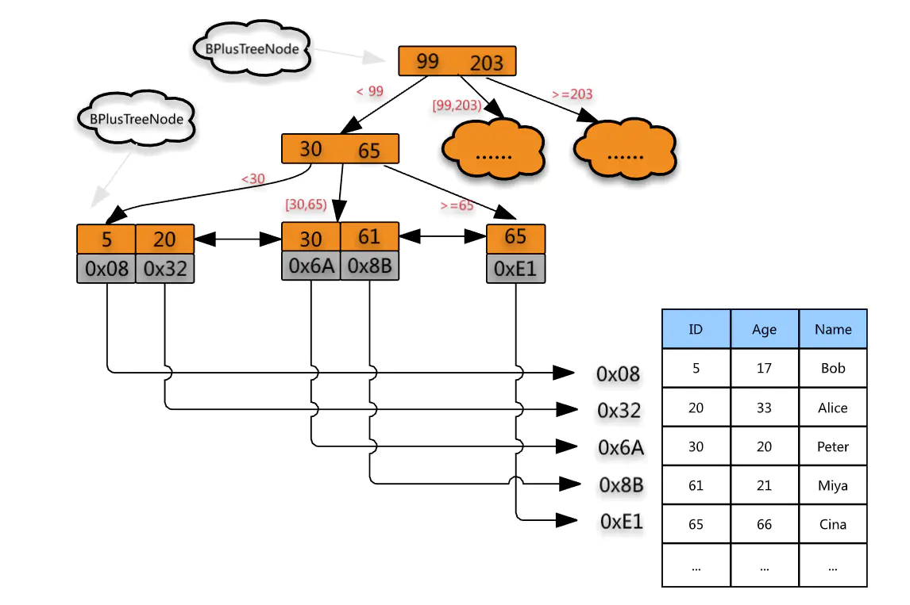
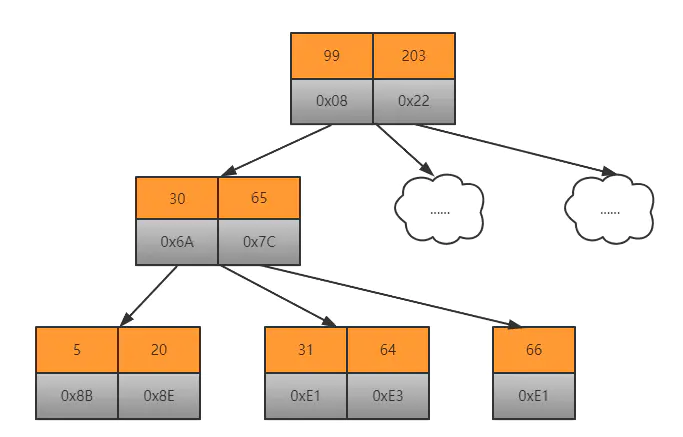

# 为什么MongoDB使用B-Tree,Mysql使用B+Tree ?

除了 B+ 树，你可能还听说过 B 树、 B- 树，实际上， B- 树就是 B 树，英文翻译都是 B-Tree ，这里的 “-” 并不是相对 B+ 树中的 “+” ，而只是一个连接符。而 B 树实际上是低级版的B+ 树，或者说 B+ 树是 B 树的改进版。

### B+ tree

B+ tree 实际上是一颗m叉平衡查找树(不是二叉树)

> 平衡查找树定义：树中任意一个节点的左右子树的高度相差不能大于 1





```java
/**
* 这是B+树非叶子节点的定义。
*
* 假设keywords=[3, 5, 8, 10]
* 4个键值将数据分为5个区间：(-INF,3), [3,5), [5,8), [8,10), [10,INF)
* 5个区间分别对应：children[0]...children[4]
*
* m值是事先计算得到的，计算的依据是让所有信息的大小正好等于页的大小：
* PAGE_SIZE = (m-1)*4[keywordss大小]+m*8[children大小]
*/
public class BPlusTreeNode {
  // 5叉树
  public static int m = 5;

  // 键值，用来划分数据区间
  public int[] keywords = new int[m-1];

  // 保存子节点指针
  public BPlusTreeNode[] children = new BPlusTreeNode[m];
}
/**
* 这是B+树中叶子节点的定义。
*
* B+树中的叶子节点跟内部结点是不一样的,
* 叶子节点存储的是值，而非区间。
* 这个定义里，每个叶子节点存储3个数据行的键值及地址信息。
*
* k值是事先计算得到的，计算的依据是让所有信息的大小正好等于页的大小：
* PAGE_SIZE = k*4[keyw..大小]+k*8[dataAd..大小]+8[prev大小]+8[next大小]
*/
public class BPlusTreeLeafNode {
  public static int k = 3;

  // 数据的键值
  public int[] keywords = new int[k];

  // 数据地址
  public long[] dataAddress = new long[k];

  // 这个结点在链表中的前驱结点
  public BPlusTreeLeafNode prev;

  // 这个结点在链表中的后继结点 
  public BPlusTreeLeafNode next;
}

```

在B+ 树中，树中的节点并不存储数据本身，而是只是作为索引。除此之外，所有记录的节点按大小顺序存储在同一层的叶节点中，并且每个叶节点通过指针连接。

#### 总结下,B+树有以下特点

1. B +树的每个节点可以包含更多节点，其原因有两个，其一是降低树的高度(索引不会全部存储在内存中,内存中可能撑不住,所以一般都是将索引树存储在磁盘中，只是将根节点放到内存中，这样对每个节点的访问,实际上就是访问磁盘,树的高度就等于每次查询数据时磁盘 IO 操作的次数),另一种是将数据范围更改为多个间隔。间隔越大，数据检索越快(可以想象跳表)
2. 每个节点不在是存储一个key,而是存储多个key
3. 叶节点来存储数据，而其他节点用于索引
4. 叶子节点通过两个指针相互链接，顺序查询性能更高。

#### 这样设计还有以下优点：

1. B +树的非叶子节点仅存储键，占用很小的空间，因此节点的每一层可以索引的数据范围要宽得多。换句话说，可以为每个IO操作搜索更多数据
2. 叶子节点成对连接，符合磁盘的预读特性。例如，叶节点存储50和55，它们具有指向叶节点60和62的指针。当我们从磁盘读取对应于50和55的数据时，由于磁盘的预读特性，我们将顺便提一下60和62。读出相应的数据。这次是顺序读取，而不是磁盘搜索，加快了速度。
3. 支持范围查询，局部范围查询非常高效，每个节点都可以索引更大，更准确的范围，这意味着B +树单磁盘IO信息大于B树，并且I / O效率更高
4. 由于数据存储在叶节点层中，并且有指向其他叶节点的指针，因此范围查询仅需要遍历叶节点层，而无需遍历整个树。

由于磁盘访问速度和内存之间存在差距，为了提高效率，应将磁盘I / O最小化。磁盘通常不是严格按需读取的，而是每次都被预读。磁盘读取所需的数据后，它将向后读取内存中的一定长度的数据。这样做的理论基础是计算机科学中众所周知的本地原理：

> 关于MySQL数据索引是如何实现的，可以参考这篇文章：[time.geekbang.org/column/arti…](https://time.geekbang.org/column/article/77830)

### B-Tree

B-Tree实际上也是一颗m叉平衡查找树





1. 所有的key值分布在整个树中
2. 所有的key值出现在一个节点中
3. 搜索可以在非叶子节点处结束
4. 在完整的关键字搜索过程中，性能接近二分搜索。

### B树和B+树之间的区别

1. B +树中的非叶子节点不存储数据，并且存储在叶节点中的所有数据使得查询时间复杂度固定为log n。
2. B树查询时间的复杂度不是固定的，它与键在树中的位置有关，最好是O（1）。
3. 由于B+树的叶子节点是通过双向链表链接的，所以支持范围查询，且效率比B树高
4. B树每个节点的键和数据是一起的

### 为什么MongoDB使用B-Tree,Mysql使用B+Tree ?

B +树中的非叶子节点不存储数据，并且存储在叶节点中的所有数据使得查询时间复杂度固定为log n。B树查询时间复杂度不是固定的，它与键在树中的位置有关，最好是O(1)。

**我们已经说过，尽可能少的磁盘IO是提高性能的有效方法。MongoDB是一个聚合数据库，而B树恰好是键域和数据域的集群。**

至于为什么MongoDB使用B树而不是B +树，可以从其设计的角度考虑它。 MongoDB不是传统的关系数据库，而是以BSON格式(可以认为是JSON)存储的nosql。目的是高性能，高可用性和易于扩展。

Mysql是关系型数据库，最常用的是数据遍历操作(join)，而MongoDB它的数据更多的是聚合过的数据，不像Mysql那样表之间的关系那么强烈,因此MongoDB更多的是单个查询。

由于Mysql使用B+树，数据在叶节点上,叶子节点之间又通过双向链表连接,更加有利于数据遍历，而MongoDB使用B树,所有节点都有一个数据字段。只要找到指定的索引，就可以对其进行访问。毫无疑问，单个查询MongoDB平均查询速度比Mysql快。

### Hash索引

简而言之，哈希索引使用某种哈希算法将键值转换为新的哈希值。不需要像B +树那样从根节点到叶节点逐步搜索。只需要一种哈希算法,就可以立即找到对应的位置，速度非常快。(此处可以想想Java中的HashMap)。

#### B+树索引和Hash索引的区别

1. 如果是等价查询，则哈希索引显然具有绝对优势，因为只需一种算法即可找到相应的键值；当然，前提是键值是唯一的,如果存在hash冲突就必须链表遍历了。
2. 哈希索引不支持范围查询(不过改造之后可以,Java中的LinkedHashMap通过链表保存了节点的插入顺序,那么也可以使用链表将数据的大小顺序保存起来)

> 这样做虽然支持了范围查询但是时间复杂度是O(n),效率比跳表和B+Tree差

1. 哈希索引无法使用索引排序以及模糊匹配
2. 哈希索引也不支持多列联合索引的最左边匹配规则。
3. 键值大量冲突的情况下,Hash索引效率极低


https://juejin.im/post/5ea273f951882573cd41c7a4