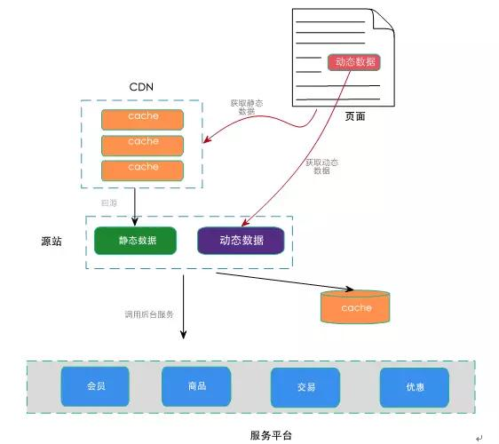
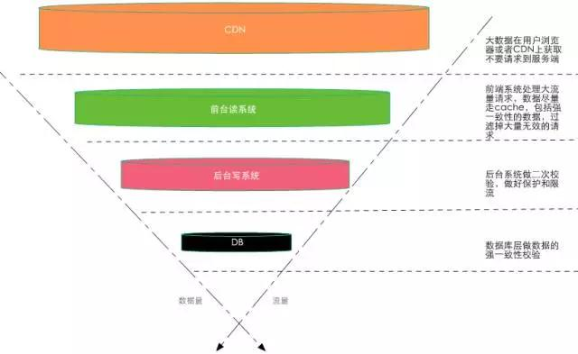
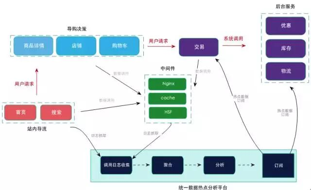
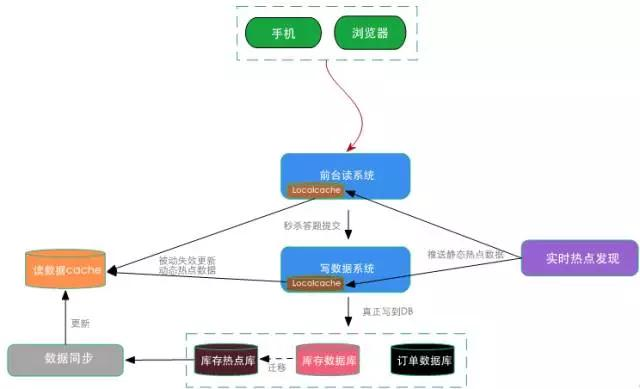

# 淘宝大秒系统设计详解

Java识堂 2020-04-09 09:01:00

## **一些数据**

大家还记得2013年的小米秒杀吗？三款小米手机各11万台开卖，走的都是大秒系统，3分钟后成为双十一第一家也是最快破亿的旗舰店。经过日志统计，前端系统双11峰值有效请求约60w以上的QPS ，而后端cache的集群峰值近2000w/s、单机也近30w/s，但到真正的写时流量要小很多了，当时最高下单减库存tps是红米创造，达到1500/s。

## **热点隔离**

秒杀系统设计的第一个原则就是将这种热点数据隔离出来，不要让1%的请求影响到另外的99%，隔离出来后也更方便对这1%的请求做针对性优化。针对秒杀我们做了多个层次的隔离：

- **业务隔离。**把秒杀做成一种营销活动，卖家要参加秒杀这种营销活动需要单独报名，从技术上来说，卖家报名后对我们来说就是已知热点，当真正开始时我们可以提前做好预热。
- **系统隔离。**系统隔离更多是运行时的隔离，可以通过分组部署的方式和另外99%分开。秒杀还申请了单独的域名，目的也是让请求落到不同的集群中。
- **数据隔离。**秒杀所调用的数据大部分都是热数据，比如会启用单独cache集群或MySQL数据库来放热点数据，目前也是不想0.01%的数据影响另外99.99%。

当然实现隔离很有多办法，如可以按照用户来区分，给不同用户分配不同cookie，在接入层路由到不同服务接口中；还有在接入层可以对URL的不同Path来设置限流策略等。服务层通过调用不同的服务接口；数据层可以给数据打上特殊的标来区分。目的都是把已经识别出来的热点和普通请求区分开来。

## **动静分离**

前面介绍在系统层面上的原则是要做隔离，接下去就是要把热点数据进行动静分离，这也是解决大流量系统的一个重要原则。如何给系统做动静分离的静态化改造我以前写过一篇《高访问量系统的静态化架构设计》详细介绍了淘宝商品系统的静态化设计思路，感兴趣的可以在《程序员》杂志上找一下。我们的大秒系统是从商品详情系统发展而来，所以本身已经实现了动静分离，如图1。

图1 大秒系统动静分离

除此之外还有如下特点：

- 把整个页面Cache在用户浏览器
- 如果强制刷新整个页面，也会请求到CDN
- 实际有效请求只是“刷新抢宝”按钮

这样把90%的静态数据缓存在用户端或者CDN上，当真正秒杀时用户只需要点击特殊的按钮“刷新抢宝”即可，而不需要刷新整个页面，这样只向服务端请求很少的有效数据，而不需要重复请求大量静态数据。秒杀的动态数据和普通的详情页面的动态数据相比更少，性能也比普通的详情提升3倍以上。所以“刷新抢宝”这种设计思路很好地解决了不刷新页面就能请求到服务端最新的动态数据。

## **基于时间分片削峰**

熟悉淘宝秒杀的都知道，第一版的秒杀系统本身并没有答题功能，后面才增加了秒杀答题，当然秒杀答题一个很重要的目的是为了防止秒杀器，2011年秒杀非常火的时候，秒杀器也比较猖獗，而没有达到全民参与和营销的目的，所以增加的答题来限制秒杀器。增加答题后，下单的时间基本控制在2s后，秒杀器的下单比例也下降到5%以下。新的答题页面如图2。

图2 秒答题页面

其实增加答题还有一个重要的功能，就是把峰值的下单请求给拉长了，从以前的1s之内延长到2~10s左右，请求峰值基于时间分片了，这个时间的分片对服务端处理并发非常重要，会减轻很大压力，另外由于请求的先后，靠后的请求自然也没有库存了，也根本到不了最后的下单步骤，所以真正的并发写就非常有限了。其实这种设计思路目前也非常普遍，如支付宝的“咻一咻”已及微信的摇一摇。

除了在前端通过答题在用户端进行流量削峰外，在服务端一般通过锁或者队列来控制瞬间请求。

## **数据分层校验**

图3 分层校验

对大流量系统的数据做分层校验也是最重要的设计原则，所谓分层校验就是对大量的请求做成“漏斗”式设计，如图3所示：在不同层次尽可能把无效的请求过滤，“漏斗”的最末端才是有效的请求，要达到这个效果必须对数据做分层的校验，下面是一些原则：

- 先做数据的动静分离
- 将90%的数据缓存在客户端浏览器
- 将动态请求的读数据Cache在Web端
- 对读数据不做强一致性校验
- 对写数据进行基于时间的合理分片
- 对写请求做限流保护
- 对写数据进行强一致性校验

秒杀系统正是按照这个原则设计的系统架构，如图4所示。

图4 秒杀系统分层架构

把大量静态不需要检验的数据放在离用户最近的地方；在前端读系统中检验一些基本信息，如用户是否具有秒杀资格、商品状态是否正常、用户答题是否正确、秒杀是否已经结束等；在写数据系统中再校验一些如是否是非法请求，营销等价物是否充足（淘金币等），写的数据一致性如检查库存是否还有等；最后在数据库层保证数据最终准确性，如库存不能减为负数。

## **实时热点发现**

其实秒杀系统本质是还是一个数据读的热点问题，而且是最简单一种，因为在文提到通过业务隔离，我们已能提前识别出这些热点数据，我们可以提前做一些保护，提前识别的热点数据处理起来还相对简单，比如分析历史成交记录发现哪些商品比较热门，分析用户的购物车记录也可以发现那些商品可能会比较好卖，这些都是可以提前分析出来的热点。比较困难的是那种我们提前发现不了突然成为热点的商品成为热点，这种就要通过实时热点数据分析了，目前我们设计可以在3s内发现交易链路上的实时热点数据，然后根据实时发现的热点数据每个系统做实时保护。 具体实现如下：

- 构建一个异步的可以收集交易链路上各个中间件产品如Tengine、Tair缓存、HSF等本身的统计的热点key（Tengine和Tair缓存等中间件产品本身已经有热点统计模块）。
- 建立一个热点上报和可以按照需求订阅的热点服务的下发规范,主要目的是通过交易链路上各个系统（详情、购物车、交易、优惠、库存、物流）访问的时间差，把上游已经发现的热点能够透传给下游系统，提前做好保护。比如大促高峰期详情系统是最早知道的，在统计接入层上Tengine模块统计的热点URL。
- 将上游的系统收集到热点数据发送到热点服务台上，然后下游系统如交易系统就会知道哪些商品被频繁调用，然后做热点保护。如图5所示。

图5 实时热点数据后台

重要的几个：其中关键部分包括：

- 这个热点服务后台抓取热点数据日志最好是异步的，一方面便于做到通用性，另一方面不影响业务系统和中间件产品的主流程。
- 热点服务后台、现有各个中间件和应用在做的没有取代关系，每个中间件和应用还需要保护自己，热点服务后台提供一个收集热点数据提供热点订阅服务的统一规范和工具，便于把各个系统热点数据透明出来。
- 热点发现要做到实时（3s内）。

## **关键技术优化点**

前面介绍了一些如何设计大流量读系统中用到的原则，但是当这些手段都用了，还是有大流量涌入该如何处理呢？秒杀系统要解决几个关键问题。

### **Java处理大并发动态请求优化**

其实Java和通用的Web服务器相比（Nginx或Apache）在处理大并发HTTP请求时要弱一点，所以一般我们都会对大流量的Web系统做静态化改造，让大部分请求和数据直接在Nginx服务器或者Web代理服务器（Varnish、Squid等）上直接返回（可以减少数据的序列化与反序列化），不要将请求落到Java层上，让Java层只处理很少数据量的动态请求，当然针对这些请求也有一些优化手段可以使用：

- **直接使用Servlet处理请求。**避免使用传统的MVC框架也许能绕过一大堆复杂且用处不大的处理逻辑，节省个1ms时间，当然这个取决于你对MVC框架的依赖程度。
- **直接输出流数据。**使用resp.getOutputStream()而不是resp.getWriter()可以省掉一些不变字符数据编码，也能提升性能；还有数据输出时也推荐使用JSON而不是模板引擎（一般都是解释执行）输出页面。

### **同一商品大并发读问题**

你会说这个问题很容易解决，无非放到Tair缓存里面就行，集中式Tair缓存为了保证命中率，一般都会采用一致性Hash，所以同一个key会落到一台机器上，虽然我们的Tair缓存机器单台也能支撑30w/s的请求，但是像大秒这种级别的热点商品还远不够，那如何彻底解决这种单点瓶颈？答案是采用应用层的Localcache，即在秒杀系统的单机上缓存商品相关的数据，如何cache数据？也分动态和静态：

- 像商品中的标题和描述这些本身不变的会在秒杀开始之前全量推送到秒杀机器上并一直缓存直到秒杀结束。
- 像库存这种动态数据会采用被动失效的方式缓存一定时间（一般是数秒），失效后再去Tair缓存拉取最新的数据。

你可能会有疑问，像库存这种频繁更新数据一旦数据不一致会不会导致超卖？其实这就要用到我们前面介绍的读数据分层校验原则了，读的场景可以允许一定的脏数据，因为这里的误判只会导致少量一些原本已经没有库存的下单请求误认为还有库存而已，等到真正写数据时再保证最终的一致性。这样在数据的高可用性和一致性做平衡来解决这种高并发的数据读取问题。

### **同一数据大并发更新问题**

解决大并发读问题采用Localcache和数据的分层校验的方式，但是无论如何像减库存这种大并发写还是避免不了，这也是秒杀这个场景下最核心的技术难题。

同一数据在数据库里肯定是一行存储（MySQL），所以会有大量的线程来竞争InnoDB行锁，当并发度越高时等待的线程也会越多，TPS会下降RT会上升，数据库的吞吐量会严重受到影响。说到这里会出现一个问题，就是单个热点商品会影响整个数据库的性能，就会出现我们不愿意看到的0.01%商品影响99.99%的商品，所以一个思路也是要遵循前面介绍第一个原则进行隔离，把热点商品放到单独的热点库中。但是无疑也会带来维护的麻烦（要做热点数据的动态迁移以及单独的数据库等）。

分离热点商品到单独的数据库还是没有解决并发锁的问题，要解决并发锁有两层办法。

- **应用层做排队。**按照商品维度设置队列顺序执行，这样能减少同一台机器对数据库同一行记录操作的并发度，同时也能控制单个商品占用数据库连接的数量，防止热点商品占用太多数据库连接。
- **数据库层做排队。**应用层只能做到单机排队，但应用机器数本身很多，这种排队方式控制并发仍然有限，所以如果能在数据库层做全局排队是最理想的，淘宝的数据库团队开发了针对这种MySQL的InnoDB层上的patch，可以做到数据库层上对单行记录做到并发排队，如图6所示。

图6 数据库层对单行记录并发排队

你可能会问排队和锁竞争不要等待吗？有啥区别？如果熟悉MySQL会知道，InnoDB内部的死锁检测以及MySQL Server和InnoDB的切换会比较耗性能，淘宝的MySQL核心团队还做了很多其他方面的优化，如COMMIT_ON_SUCCESS和ROLLBACK_ON_FAIL的patch，配合在SQL里面加hint，在事务里不需要等待应用层提交COMMIT而在数据执行完最后一条SQL后直接根据TARGET_AFFECT_ROW结果提交或回滚，可以减少网络的等待时间（平均约0.7ms）。据我所知，目前阿里MySQL团队已将这些patch及提交给MySQL官方评审。

## **大促热点问题思考**

以秒杀这个典型系统为代表的热点问题根据多年经验我总结了些通用原则：隔离、动态分离、分层校验，必须从整个全链路来考虑和优化每个环节，除了优化系统提升性能，做好限流和保护也是必备的功课。

除去前面介绍的这些热点问题外，淘系还有多种其他数据热点问题：

- 数据访问热点，比如Detail中对某些热点商品的访问度非常高，即使是Tair缓存这种Cache本身也有瓶颈问题，一旦请求量达到单机极限也会存在热点保护问题。有时看起来好像很容易解决，比如说做好限流就行，但你想想一旦某个热点触发了一台机器的限流阀值，那么这台机器Cache的数据都将无效，进而间接导致Cache被击穿，请求落地应用层数据库出现雪崩现象。这类问题需要与具体Cache产品结合才能有比较好的解决方案，这里提供一个通用的解决思路，就是在Cache的client端做本地Localcache，当发现热点数据时直接Cache在client里，而不要请求到Cache的Server。
- 数据更新热点，更新问题除了前面介绍的热点隔离和排队处理之外，还有些场景，如对商品的lastmodifytime字段更新会非常频繁，在某些场景下这些多条SQL是可以合并的，一定时间内只执行最后一条SQL就行了，可以减少对数据库的update操作。另外热点商品的自动迁移，理论上也可以在数据路由层来完成，利用前面介绍的热点实时发现自动将热点从普通库里迁移出来放到单独的热点库中。

按照某种维度建的索引产生热点数据，比如实时搜索中按照商品维度关联评价数据，有些热点商品的评价非常多，导致搜索系统按照商品ID建评价数据的索引时内存已经放不下，交易维度关联订单信息也同样有这些问题。这类热点数据需要做数据散列，再增加一个维度，把数据重新组织。

https://www.toutiao.com/a6813353539650191876/?tt_from=android_share&utm_campaign=client_share&app=news_article%C3%97tamp%3D1586441215&utm_medium=toutiao_android&req_id=202004092206540100140470212D42871D&group_id=6813353539650191876