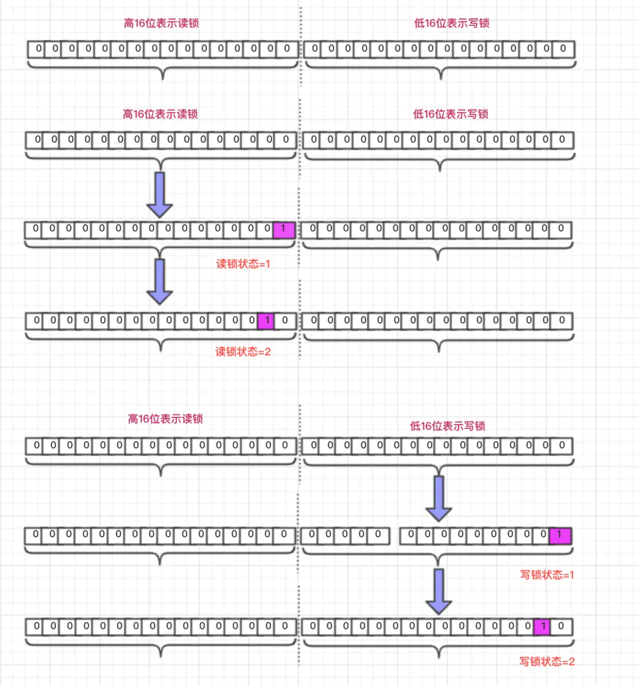

# 读写锁ReadWriteLock的实现原理

### 问题

> 在阅读本文之前可以先思考一下几个问题

- 1. 什么是读写锁？
- 1. ReadWriteLock存在的意义是什么？
- 1. 读写锁适用于什么场景？
- 1. 什么是锁降级和锁升级？

### 简介

- synchronized和ReentrantLock实现的锁是`排他锁`，所谓排他锁就是同一时刻只允许一个线程访问共享资源，但是在平时场景中，我们通常会碰到对于共享资源`读多写少`的场景。对于读场景，每次只允许一个线程访问共享资源，显然这种情况使用排他锁效率就比较低下，那么该如何优化呢？
- 这个时候`读写锁`就应运而生了，读写锁是一种通用技术，并不是Java特有的。从名字来看，读写锁拥有两把锁，`读锁`和`写锁`。读写锁的特点是：同一时刻允许多个线程对共享资源进行读操作；同一时刻只允许一个线程对共享资源进行写操作；当进行写操作时，同一时刻其他线程的读操作会被阻塞；当进行读操作时，同一时刻所有线程的写操作会被阻塞。对于读锁而言，由于同一时刻可以允许多个线程访问共享资源，进行读操作，因此称它为共享锁；而对于写锁而言，同一时刻只允许一个线程访问共享资源，进行写操作，因此称它为排他锁。
- 在Java中通过`ReadWriteLock`来实现读写锁。ReadWriteLock是一个接口，`ReentrantReadWriteLock`是ReadWriteLock接口的具体实现类。在ReentrantReadWriteLock中定义了两个内部类`ReadLock`、`WriteLock`，分别来实现读锁和写锁。ReentrantReadWriteLock底层是通过AQS来实现锁的获取与释放的，因此ReentrantReadWriteLock内部还定义了一个继承了AQS类的同步组件`Sync`，同时ReentrantReadWriteLock还`支持公平与非公平性`，因此它内部还定义了两个内部类`FairSync、NonfairSync`，它们继承了Sync。
- ReentrantReadWriteLock除了提供读锁、写锁的释放与获取外，还提供了一些其他和锁状态有关的方法。如下表所示（表格来源于《Java并发编程的艺术》一书第141页）。

| 方法名                  | 功能                                                         |
| ----------------------- | ------------------------------------------------------------ |
| int getReadLockCount()  | 获取读锁的数量，此时读锁的数量不一定等于获取锁的数量，因为锁可以重入，可能有线程重入了读锁 |
| int getReadHoldCount()  | 获取当前线程重入读锁的次数                                   |
| int getWriteHoldCount() | 获取当前线程重入写锁的次数                                   |
| int isWriteLocked()     | 判断锁的状态是否是写锁，返回true，表示锁的状态是写锁         |

### 实现原理

- 在AQS中，通过`int类型`的全局变量state来表示同步状态，即用state来表示锁。ReentrantReadWriteLock也是通过AQS来实现锁的，但是ReentrantReadWriteLock有两把锁：读锁和写锁，它们保护的都是同一个资源，那么如何用一个共享变量来区分锁是写锁还是读锁呢？答案就是`按位拆分`。
- 由于state是int类型的变量，在内存中`占用4个字节，也就是32位`。将其拆分为两部分：高16位和低16位，其中`高16位用来表示读锁状态，低16位用来表示写锁状态`。当设置读锁成功时，就将高16位加1，释放读锁时，将高16位减1；当设置写锁成功时，就将低16位加1，释放写锁时，将第16位减1。如下图所示。





- 那么如何根据state的值来判断当前锁的状态时写锁还是读锁呢？
- 假设锁当前的状态值为S，将S和16进制数`0x0000FFFF`进行`与运算`，即S&0x0000FFFF，运算时会将高16位全置为0，将运算结果记为c，那么c表示的就是写锁的数量。如果c等于0就表示还没有线程获取锁；如果c不等于0，就表示有线程获取到了锁，c等于几就代表写锁重入了几次。
- 将S`无符号右移16位`（S>>>16），得到的结果就是`读锁的数量`。当S>>>16得到的结果不等于0，且c也不等于0时，就表示当前线程既持有了写锁，也持有了读锁。
- 当成功获取到读锁时，如何对读锁进行加1呢？S +（1<<16）得到的结果，就是将对锁加1。释放读锁是，就进行S - (1<<16)运算。
- 当成功获取到写锁时，令S+1即表示写锁状态+1；释放写锁时，就进行S-1运算。
- 由于读锁和写锁的状态值都只占用16位，所以读锁的最大数量为，写锁可被重入的最大次数为。

### 源码分析

> 理解了如何通过state来表示锁的状态，接下来将通过源码来分析读写锁的源码实现。

- 通过如下代码，即可创建读锁和写锁。ReentrantReadWriteLock的构造方法中如果不传参数，`默认创建的是非公平的读写锁`。在读写锁中，仍然是`非公平的读写锁性能要由于公平的读写锁`。

```
ReadWriteLock lock = new ReentrantReadWriteLock();
// 创建读锁
Lock readLock = lock.readLock();
// 创建写锁
Lock writeLock = lock.writeLock();	
```

#### 写锁加锁

- 当调用写锁的lock()方法时，线程会尝试获取写锁，即writeLock.lock()。由于写锁是排他锁，所以写锁的获取过程几乎与ReentrantLock获取锁的逻辑一样。当调用lock()方法时，会先调用到AQS的acquire()方法，在acquire()方法中会先调用子类的tryAcquire()方法，因此这里调用的是ReentrantReadWriteLock的内部类Sync的tryAcquire()方法。该方法的源码如下。

```java
protected final boolean tryAcquire(int acquires) {
    
    Thread current = Thread.currentThread();
    int c = getState();
    // exclusiveCount()方法的作用是将同步变量与0xFFFF做&运算，计算结果就是写锁的数量。
    // 因此w的值的含义就是写锁的数量
    int w = exclusiveCount(c);
    // 如果c不为0就表示锁被占用了，但是占用的是写锁还是读书呢？这个时候就需要根据w的值来判断了。
    // 如果c等于0就表示此时锁还没有被任何线程占用，那就让线程直接去尝试获取锁
    if (c != 0) {
        // (Note: if c != 0 and w == 0 then shared count != 0)
        //
        /**
         * 1. 如果w为0，说明写锁的数量为0，而此时又因为c不等于0，说明锁被占用，但是不是写锁，那么此时锁的状态一定是读锁，
         * 既然是读锁状态，那么写锁此时来获取锁时，就肯定失败，因此当w等于0时，tryAcquire()方法返回false。
         * 2. 如果w不为0，说明此时锁的状态时写锁，接着进行current != getExclusiveOwnerThread()判断，判断持有锁的线程是否是当前线程
         * 如果不是当前线程，那么tryAcquire()返回false；如果是当前线程，那么就进行后面的逻辑。为什么是当前线程持有锁，就还能执行后面的逻辑呢？
         * 因为读写锁是支持重入的。
         */
        if (w == 0 || current != getExclusiveOwnerThread())
            return false;
        // 下面一行代码是判断，写锁的重入次数或不会超过最大限制，这个最大限制是：2的16次方减1
        // 为什么是2的16次方减1呢？因为state的低16位存放的是写锁，因此写锁数量的最大值是2的16次方减1
        if (w + exclusiveCount(acquires) > MAX_COUNT)
            throw new Error("Maximum lock count exceeded");
        // Reentrant acquire
        setState(c + acquires);
        return true;
    }
    /**
     * 1. writerShouldBlock()方法的作用是判断当前线程是否应该阻塞，对于公平的写锁和非公平写锁的具体实现不一样。
     * 对于非公平写锁而言，直接返回false，因为非公平锁获取锁之前不需要去判断是否排队
     * 对于公平锁写锁而言，它会判断同步队列中是否有人在排队，有人排队，就返回true，表示当前线程需要阻塞。无人排队就返回false。
     *
     * 2. 当writerShouldBlock()返回true时，表示当前线程还不能直接获取锁，因此tryAcquire()方法直接返回false。
     * 当writerShouldBlock()返回false时，表示当前线程可以尝试去获取锁，因此会执行if判断中后面的逻辑，即通过CAS方法尝试去修改同步变量的值，
     * 如果修改同步变量成功，则表示当前线程获取到了锁，最终tryAcquire()方法会返回true。如果修改失败，那么tryAcquire()会返回false，表示获取锁失败。
     *
     */
    if (writerShouldBlock() ||
        !compareAndSetState(c, c + acquires))
        return false;
    setExclusiveOwnerThread(current);
    return true;
} 
```

- 在tryAcquire()方法中，先通过`exclusiveCount()`方法来计算写锁的数量，怎么计算的呢？就是将state和`0x0000FFFF`进行`与运算`。
- 然后判断state是否等于0，如果等于0，就表示读锁和写锁都没有被获取，当前线程就调用`writerShouldBlock()`方法判断线程是否需要等待，如果需要等待，tryAcquire()方法就返回false，表示获取锁失败，那么就会回到AQS的acquire()方法中，后面的逻辑与排他锁的逻辑一样。如果不需要等待，就尝试去修改state的值，如果修改成功，就表示获取锁成功，否则失败。
- 如果state不等于0，那么就表示存在读锁或者写锁，那么究竟是读锁还是写锁呢？就需要根据w的值进行判断了。
- 如果w为0，说明写锁的数量为0，而此时又因为c不等于0，说明锁被占用，但是不是写锁，那么此时锁的状态一定是读锁，既然是读锁状态，那么写锁此时来获取锁时，就肯定失败，因为读锁存在时，是不能去获取写锁的。因此当w等于0时，tryAcquire()方法返回false。
- 如果w不为0，说明此时锁的状态是写锁，接着进行`current != getExclusiveOwnerThread()`判断，判断持有锁的线程是否是当前线程。如果不是当前线程，那么tryAcquire()返回false；如果是当前线程，那么就进行后面的逻辑。为什么是当前线程持有锁，就能执行后面的逻辑呢？ 因为读写锁是支持重入的。
- 如果是当前线程获取的写锁，接着就判断，再次对写锁进行重入时，会不会超出写锁的最大重入次数，如果是，就抛出异常。（因为state的低16位表示写锁，所以写锁最大可被重入的次数是-1）。

#### 写锁释放

- 写锁的释放与排他锁的释放逻辑也几乎一样。当调用writeLock.unlock()时，先调用到AQS的release()方法，在release()方法中会先调用子类的tryRelease()方法。在这里调用的是ReentrantReadWriteLock的内部类Sync的tryRelease()方法。写锁的释放逻辑比较简单，可以参考下面源码中的注释。方法的源码和注释如下。

```
protected final boolean tryRelease(int releases) {
    // 判断是否是当前线程持有锁
    if (!isHeldExclusively())
        throw new IllegalMonitorStateException();
    // 将state的值减去releases
    int nextc = getState() - releases;
    // 调用exclusiveCount()方法，计算写锁的数量。如果写锁的数量为0，表示写锁被完全释放，此时将AQS的exclusiveOwnerThread属性置为null
    // 并返回free标识，表示写锁是否被完全释放
    boolean free = exclusiveCount(nextc) == 0;
    if (free)
        setExclusiveOwnerThread(null);
    setState(nextc);
    return free;
}
复制代码
```

#### 读锁加锁

- 读锁是共享锁，所以当调用readLock.lock()方法时，会先调用到AQS的acquiredShared()方法，在acquireShared()方法中会先调用子类的tryAcquireShared()方法。在这里会调用的是ReentrantReadWriteLock的内部类Sync的`tryAcquireShared()`方法。该方法的源码如下。

```
protected final int tryAcquireShared(int unused) {
    
    Thread current = Thread.currentThread();
    int c = getState();
    // exclusiveCount(c)返回的是写锁的数量，如果它不为0，说明写锁被占用，如果此时占用写锁的线程不是当前线程，就返回-1，表示获取锁失败
    if (exclusiveCount(c) != 0 &&
        getExclusiveOwnerThread() != current)
        return -1;
    // r表示的是读锁的数量
    int r = sharedCount(c);
    /**
     * 在下面的代码中进行了三个判断：
     * 1、读锁是否应该排队。如果没有人排队，就进行if后面的判断。有人排队，就不会进行if后面的判断，而是最终调用fullTryAcquireShared()方法
     * 2、读锁数量是否超过最大值。（最大数量为2的16次方-1）
     * 3、尝试修改同步变量的值
     */
    if (!readerShouldBlock() &&
        r < MAX_COUNT &&
        compareAndSetState(c, c + SHARED_UNIT)) {
        // 读锁数量为0时，就将当前线程设置为firstReader，firstReaderHoldCount=1
        if (r == 0) {
            firstReader = current;
            firstReaderHoldCount = 1;
        } else if (firstReader == current) {
            // 读锁数量不为0且firstReader(第一次获取读的线程)为当前线程，就将firstReaderHoldCount累加
            firstReaderHoldCount++;
        } else {
            // 读锁数量不为0，且第一个获取到读锁的线程不是当前线程
            // 下面这一段逻辑就是保存当前线程获取读锁的次数，如何保存的呢？
            // 通过ThreadLocal来实现的，readHolds就是一个ThreadLocal的实例
            HoldCounter rh = cachedHoldCounter;
            if (rh == null || rh.tid != getThreadId(current))
                cachedHoldCounter = rh = readHolds.get();
            else if (rh.count == 0)
                readHolds.set(rh);
            rh.count++;
        }
        // 返回1表示获取读锁成功
        return 1;
    }
    // 当if中的三个判断均不满足时，就会执行到这儿，调用fullTryAcquireShared()方法尝试获取锁
    return fullTryAcquireShared(current);
}
复制代码
```

- 在tryAcquireShared()方法中，会先通过`exclusiveCount()`方法来计算写锁的数量，如果写锁存在，再判断持有写锁的线程是不是当前线程，如果不是当前线程，就表示写锁被其他线程给占用，此时当前线程不能获取读锁。tryAcquireShared()方法返回-1，表示获取读锁失败。如果写锁不存在或者持有写锁的线程是当前线程，那么就表示当前线程有机会获取到读锁。
- 接下里会判断当前线程获取读锁是否不需要排队，读锁数量是否会超过最大值，以及通过CAS修改读锁的状态是否成功（将state的值加 1<<16）。如果这三个条件成立，就进入if语句块中，这一块的代码比较繁琐，但是功能比较单一，就是统计读锁的数量以及当前线程对读锁的重入次数，底层原理就是`ThreadLocal`。因为在读写锁中提供了`getReadLockCount()、getReadHoldCount()`等方法，这几个方法的数据就来自这儿。
- 如果上面的三个条件有一个不成立，就不会进入if语句块，那么就会调用fullTryAcquireShared()方法。该方法的作用就是让线程不停的获取锁，其源码如下。

```
final int fullTryAcquireShared(Thread current) {
    /*
     * This code is in part redundant with that in
     * tryAcquireShared but is simpler overall by not
     * complicating tryAcquireShared with interactions between
     * retries and lazily reading hold counts.
     */
    HoldCounter rh = null;
    // for死循环，直到满足相应的条件才会return退出，否则一直循环
    for (;;) {
        int c = getState();
        // 锁的状态为写锁时，持有锁的线程不等于当期那线程，就说明当前线程获取锁失败，返回-1
        if (exclusiveCount(c) != 0) {
            if (getExclusiveOwnerThread() != current)
                return -1;
            // else we hold the exclusive lock; blocking here
            // would cause deadlock.
        } else if (readerShouldBlock()) {
            // Make sure we're not acquiring read lock reentrantly
            if (firstReader == current) {
                // assert firstReaderHoldCount > 0;
            } else {
                if (rh == null) {
                    rh = cachedHoldCounter;
                    if (rh == null || rh.tid != getThreadId(current)) {
                        rh = readHolds.get();
                        if (rh.count == 0)
                            readHolds.remove();
                    }
                }
                if (rh.count == 0)
                    return -1;
            }
        }
        if (sharedCount(c) == MAX_COUNT)
            throw new Error("Maximum lock count exceeded");
        // 尝试设置同步变量的值，只要设置成功了，就表示当前线程获取到了锁，然后就设置锁的获取次数等相关信息
        if (compareAndSetState(c, c + SHARED_UNIT)) {
            if (sharedCount(c) == 0) {
                firstReader = current;
                firstReaderHoldCount = 1;
            } else if (firstReader == current) {
                firstReaderHoldCount++;
            } else {
                if (rh == null)
                    rh = cachedHoldCounter;
                if (rh == null || rh.tid != getThreadId(current))
                    rh = readHolds.get();
                else if (rh.count == 0)
                    readHolds.set(rh);
                rh.count++;
                cachedHoldCounter = rh; // cache for release
            }
            return 1;
        }
    }
}
复制代码
```

- 当获取到读锁成功以后，tryAcquireShared()方法会返回1，这样当回到AQS的acquireShared()方法时，就会直接结束了。如果获取锁失败，tryAcquireShared()方法会返回-1，那么在AQS中，就会接着执行doAcquireShared()方法。doAcquireShared()方法的作用就是将自己加入到同步队列中，等待获取锁，直到获取锁成功。该方法不响应中断。

#### 读锁释放

- 当调用readLock.unlock()方法时，会先调用到AQS的releaseShared()方法，在releaseShared()方法中会先调用子类的tryReleaseShared()方法。在这里会调用的是ReentrantReadWriteLock的内部类Sync的`tryReleaseShared()`方法。该方法的源码如下。

```
protected final boolean tryReleaseShared(int unused) {
    Thread current = Thread.currentThread();
    if (firstReader == current) {
        // assert firstReaderHoldCount > 0;
        if (firstReaderHoldCount == 1)
            firstReader = null;
        else
            firstReaderHoldCount--;
    } else {
        HoldCounter rh = cachedHoldCounter;
        if (rh == null || rh.tid != getThreadId(current))
            rh = readHolds.get();
        int count = rh.count;
        if (count <= 1) {
            readHolds.remove();
            if (count <= 0)
                throw unmatchedUnlockException();
        }
        --rh.count;
    }
    for (;;) {
        int c = getState();
        // 将修改同步变量的值（读锁状态减去1<<16）
        int nextc = c - SHARED_UNIT;
        if (compareAndSetState(c, nextc))
            // Releasing the read lock has no effect on readers,
            // but it may allow waiting writers to proceed if
            // both read and write locks are now free.
            return nextc == 0;
    }
}
复制代码
```

- 在tryReleaseShared()方法中，会先修改和读锁计数有关的数据，然后在for的死循环中，通过CAS操作将state的值减去1<<16。如果CAS操作成功，才会从for循环中退出。当读锁数量为0时，tryReleaseShared()返回true，表示锁被完全释放。
- 当tryReleaseShared()方法返回后，接下来的步骤和共享锁的释放逻辑完全一样的。

### 注意事项

- 读写锁的使用十分简单，但是在读写锁的使用过程中，需要注意以下两点。
- `1.` 读写锁`不支持锁升级`，`支持锁降级`。锁升级指的是线程获取到了读锁，在没有释放读锁的前提下，又获取写锁。锁降级指的是线程获取到了写锁，在没有释放写锁的情况下，又获取读锁。为什么不支持锁升级呢？可以参考如下示例代码。

```
public void lockUpgrade(){
    ReadWriteLock lock = new ReentrantReadWriteLock();
    // 创建读锁
    Lock readLock = lock.readLock();
    // 创建写锁
    Lock writeLock = lock.writeLock();
    readLock.lock();
    try{
        // ...处理业务逻辑
        writeLock.lock();   // 代码①
    }finally {
        readLock.unlock();
    }
}
```

- 在上面的示例代码中，假如T1线程先获取到了读锁，然后执行后面的代码，在执行到代码①的上一行时，T2线程也去获取读锁，由于读锁是共享锁，且此时写锁还没有被获取，所以此时T2线程可以获取到读锁，当T1执行到代码①时，尝试去获取写锁，由于有T2线程占用了读锁，所以T1线程是无法获取到写锁的，只能等待，当T2也执行到代码①时，由于T1占有了读锁，导致T2无法获取到写锁，这样两个线程就一直等待，即获取不到写锁，也释放不掉读锁。因此锁是不支持锁升级的。
- 读写锁支持锁的降级，锁的降级是为了保证可见性。让T1线程对数据的修改对其他线程可见。
- `2.` 读锁不支持条件等待队列。当调用ReadLock类的newCondition()方法时，会直接抛出异常。

```
public Condition newCondition() {
    throw new UnsupportedOperationException();
}
复制代码
```

- 因为读锁是共享锁，最大获取次数为-1），同一时刻可以被多个线程持有，对于读锁而言，其他线程没有必要等待获取读锁，Condition的等待唤醒毫无意义。

### 总结

- 本文先简单介绍了读写锁的功能，它由两把锁组成：读锁和写锁。然后介绍了读写锁的一些特性。接着分析了如何通过state这一个变量来表示读写锁的状态，state的高16位表示读锁，低16位表示写锁，将state和`0x0000FFFF`进行`与运算`，得到的就是写锁的数量。
- 最后分别通过源码分析了写锁的释放与获取过程，读锁的释放与获取过程。其中写锁是排他锁，因此它的释放和获取调用的是AQS中的独占式释放锁和获取锁的方法，读锁是共享锁，因此它的释放与获取调用的是AQS中的共享式释放锁和获取锁的方法。

### 相关推荐

- [管程:并发编程的基石](https://mp.weixin.qq.com/s/6jvA5jnnMkr5l-IliDL8yw)
- [初识CAS的实现原理](https://mp.weixin.qq.com/s/oe046IRUbYeXpIpYLz19ew)
- [Unsafe类的源码解读以及使用场景](https://mp.weixin.qq.com/s/V8Rc3OlcI6D66ggCP2scRQ)
- [队列同步器（AQS）的设计原理](https://mp.weixin.qq.com/s/a04VUQMHZAX8e9b3MVs8zw)
- [队列同步器（AQS）源码分析](https://mp.weixin.qq.com/s/xIZlHydPxLmnClNckqKrZw)
- [可重入锁（ReentrantLock）源码分析](https://mp.weixin.qq.com/s/VHCVoBn3KBt95VMgT1wQDA)
- [公平锁与非公平锁的对比](https://mp.weixin.qq.com/s/hYLpsP_9Oxc9pSx3AGW5TQ)
- [通过源码看Bean的创建过程](https://mp.weixin.qq.com/s/WwjicbYtcjRNDgj2bRuOoQ)
- [Spring源码系列之容器启动流程](https://mp.weixin.qq.com/s/q6zs7xRjpcB4YxLw6w477w)
- [Spring中最！最！最！重要的后置处理器！没有之一！！！](https://mp.weixin.qq.com/s/f2vSH9YNmnNqdps05LEEHw)
- [@Import和@EnableXXX](https://mp.weixin.qq.com/s/y_2Z9m0gevp-cMkEIflrwA)
- [手写一个Redis和Spring整合的插件](https://mp.weixin.qq.com/s/AU0QpzD0xNslgeWEJ6ujQg)
- [为什么JDK的动态代理要基于接口实现而不能基于继承实现？](https://mp.weixin.qq.com/s/vLnjd80q9q1SNZy6yvzqYw)
- [FactoryBean——Spring的扩展点之一](https://mp.weixin.qq.com/s/NewVzdhA_BNq-LtOahxSAQ)
- [@Autowired注解的实现原理](https://mp.weixin.qq.com/s/qNuGgzPiOha0e1tCW46e8Q)
- [一次策略设计模式的实际应用](https://mp.weixin.qq.com/s/DOBnL1q6UMpWrcrKVvOkdw)
- [Spring如何解决循环依赖](https://mp.weixin.qq.com/s/W-GO189Shn0U78j7XHNxHQ)
- [并发编程中条件变量Condition的源码分析](https://mp.weixin.qq.com/s/cb8Xtr1wGorfArzNbfbrrw)


作者：天堂同志
链接：https://juejin.cn/post/6844903988169555975
来源：掘金
著作权归作者所有。商业转载请联系作者获得授权，非商业转载请注明出处。