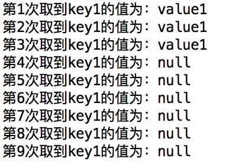
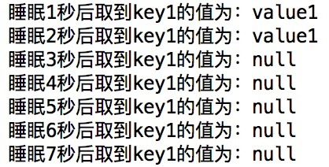
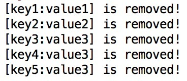
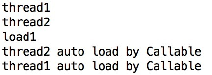

[TOC]

# Guava Cache用法介绍

/Users/jerryye/backup/studio/AvailableCode/basis/guava/guava_demo/src/main/java/com/gtt/caches/CachesTest.java

Guava Cache是在内存中缓存数据，相比较于数据库或redis存储，访问内存中的数据会更加高效。Guava官网介绍，下面的这几种情况可以考虑使用Guava Cache：

1. 愿意消耗一些内存空间来提升速度。
2. 预料到某些键会被多次查询。
3. 缓存中存放的数据总量不会超出内存容量。

所以，可以将程序频繁用到的少量数据存储到Guava Cache中，以改善程序性能。下面对Guava Cache的用法进行详细的介绍。

## 构建缓存对象

接口Cache代表一块缓存，它有如下方法：

```java
public interface Cache<K, V> {
    V get(K key, Callable<? extends V> valueLoader) throws ExecutionException;

    ImmutableMap<K, V> getAllPresent(Iterable<?> keys);

    void put(K key, V value);

    void putAll(Map<? extends K, ? extends V> m);

    void invalidate(Object key);

    void invalidateAll(Iterable<?> keys);

    void invalidateAll();

    long size();

    CacheStats stats();

    ConcurrentMap<K, V> asMap();

    void cleanUp();
}
```

可以通过CacheBuilder类构建一个缓存对象，CacheBuilder类采用builder设计模式，它的每个方法都返回CacheBuilder本身，直到build方法被调用。构建一个缓存对象代码如下。

```java
public class StudyGuavaCache {
    public static void main(String[] args) {
        Cache<String,String> cache = CacheBuilder.newBuilder().build();
        cache.put("word","Hello Guava Cache");
        System.out.println(cache.getIfPresent("word"));
    }
}
```

上面的代码通过**CacheBuilder.newBuilder().build()**这句代码创建了一个Cache缓存对象，并在缓存对象中存储了*key*为word，*value*为Hello Guava Cache的一条记录。可以看到Cache非常类似于JDK中的Map，但是相比于Map，Guava Cache提供了很多更强大的功能。

## 设置最大存储

Guava Cache可以在构建缓存对象时指定缓存所能够存储的最大记录数量。当Cache中的记录数量达到最大值后再调用put方法向其中添加对象，Guava会先从当前缓存的对象记录中选择一条删除掉，腾出空间后再将新的对象存储到Cache中。

```java
public class StudyGuavaCache {
    public static void main(String[] args) {
        Cache<String,String> cache = CacheBuilder.newBuilder()
                .maximumSize(2)
                .build();
        cache.put("key1","value1");
        cache.put("key2","value2");
        cache.put("key3","value3");
        System.out.println("第一个值：" + cache.getIfPresent("key1"));
        System.out.println("第二个值：" + cache.getIfPresent("key2"));
        System.out.println("第三个值：" + cache.getIfPresent("key3"));
    }
}
```

上面代码在构造缓存对象时，通过CacheBuilder类的maximumSize方法指定Cache最多可以存储两个对象，然后调用Cache的put方法向其中添加了三个对象。程序执行结果如下图所示，可以看到第三条对象记录的插入，导致了第一条对象记录被删除。


## 设置过期时间

在构建Cache对象时，可以通过CacheBuilder类的expireAfterAccess和expireAfterWrite两个方法为缓存中的对象指定过期时间，过期的对象将会被缓存自动删除。其中，expireAfterWrite方法指定对象被写入到缓存后多久过期，expireAfterAccess指定对象多久没有被访问后过期。

```java
public class StudyGuavaCache {
    public static void main(String[] args) throws InterruptedException {
        Cache<String,String> cache = CacheBuilder.newBuilder()
                .maximumSize(2)
                .expireAfterWrite(3,TimeUnit.SECONDS)
                .build();
        cache.put("key1","value1");
        int time = 1;
        while(true) {
            System.out.println("第" + time++ + "次取到key1的值为：" + cache.getIfPresent("key1"));
            Thread.sleep(1000);
        }
    }
}
```

上面的代码在构造Cache对象时，通过CacheBuilder的expireAfterWrite方法指定put到Cache中的对象在3秒后会过期。在Cache对象中存储一条对象记录后，每隔1秒读取一次这条记录。程序运行结果如下图所示，可以看到，前三秒可以从Cache中获取到对象，超过三秒后，对象从Cache中被自动删除。


下面代码是expireAfterAccess的例子。

```java
public class StudyGuavaCache {
    public static void main(String[] args) throws InterruptedException {
        Cache<String,String> cache = CacheBuilder.newBuilder()
                .maximumSize(2)
                .expireAfterAccess(3,TimeUnit.SECONDS)
                .build();
        cache.put("key1","value1");
        int time = 1;
        while(true) {
            Thread.sleep(time*1000);
            System.out.println("睡眠" + time++ + "秒后取到key1的值为：" + cache.getIfPresent("key1"));
        }
    }
}
```

通过CacheBuilder的expireAfterAccess方法指定Cache中存储的对象如果超过3秒没有被访问就会过期。while中的代码每sleep一段时间就会访问一次Cache中存储的对象key1，每次访问key1之后下次sleep的时间会加长一秒。程序运行结果如下图所示，从结果中可以看出，当超过3秒没有读取key1对象之后，该对象会自动被Cache删除。


也可以同时用expireAfterAccess和expireAfterWrite方法指定过期时间，这时只要对象满足两者中的一个条件就会被自动过期删除。

## 弱引用

可以通过weakKeys和weakValues方法指定Cache只保存对缓存记录key和value的弱引用。这样当没有其他强引用指向key和value时，key和value对象就会被垃圾回收器回收。

```
public class StudyGuavaCache {
    public static void main(String[] args) throws InterruptedException {
        Cache<String,Object> cache = CacheBuilder.newBuilder()
                .maximumSize(2)
                .weakValues()
                .build();
        Object value = new Object();
        cache.put("key1",value);

        value = new Object();//原对象不再有强引用
        System.gc();
        System.out.println(cache.getIfPresent("key1"));
    }
}
```

上面代码的打印结果是null。构建Cache时通过weakValues方法指定Cache只保存记录值的一个弱引用。当给value引用赋值一个新的对象之后，就不再有任何一个强引用指向原对象。System.gc()触发垃圾回收后，原对象就被清除了。

## 显示清除

可以调用Cache的invalidateAll或invalidate方法显示删除Cache中的记录。invalidate方法一次只能删除Cache中一个记录，接收的参数是要删除记录的key。invalidateAll方法可以批量删除Cache中的记录，当没有传任何参数时，invalidateAll方法将清除Cache中的全部记录。invalidateAll也可以接收一个Iterable类型的参数，参数中包含要删除记录的所有key值。下面代码对此做了示例。

```
public class StudyGuavaCache {
    public static void main(String[] args) throws InterruptedException {
        Cache<String,String> cache = CacheBuilder.newBuilder().build();
        Object value = new Object();
        cache.put("key1","value1");
        cache.put("key2","value2");
        cache.put("key3","value3");

        List<String> list = new ArrayList<String>();
        list.add("key1");
        list.add("key2");

        cache.invalidateAll(list);//批量清除list中全部key对应的记录
        System.out.println(cache.getIfPresent("key1"));
        System.out.println(cache.getIfPresent("key2"));
        System.out.println(cache.getIfPresent("key3"));
    }
}
```

代码中构造了一个集合list用于保存要删除记录的key值，然后调用invalidateAll方法批量删除key1和key2对应的记录，只剩下key3对应的记录没有被删除。

## 移除监听器

可以为Cache对象添加一个移除监听器，这样当有记录被删除时可以感知到这个事件。

```
public class StudyGuavaCache {
    public static void main(String[] args) throws InterruptedException {
        RemovalListener<String, String> listener = new RemovalListener<String, String>() {
            public void onRemoval(RemovalNotification<String, String> notification) {
                System.out.println("[" + notification.getKey() + ":" + notification.getValue() + "] is removed!");
            }
        };
        Cache<String,String> cache = CacheBuilder.newBuilder()
                .maximumSize(3)
                .removalListener(listener)
                .build();
        Object value = new Object();
        cache.put("key1","value1");
        cache.put("key2","value2");
        cache.put("key3","value3");
        cache.put("key4","value3");
        cache.put("key5","value3");
        cache.put("key6","value3");
        cache.put("key7","value3");
        cache.put("key8","value3");
    }
}
```

removalListener方法为Cache指定了一个移除监听器，这样当有记录从Cache中被删除时，监听器listener就会感知到这个事件。程序运行结果如下图所示。


## 自动加载

Cache的get方法有两个参数，第一个参数是要从Cache中获取记录的key，第二个记录是一个Callable对象。当缓存中已经存在key对应的记录时，get方法直接返回key对应的记录。如果缓存中不包含key对应的记录，Guava会启动一个线程执行Callable对象中的call方法，call方法的返回值会作为key对应的值被存储到缓存中，并且被get方法返回。下面是一个多线程的例子：

```
public class StudyGuavaCache {

    private static Cache<String,String> cache = CacheBuilder.newBuilder()
            .maximumSize(3)
            .build();

    public static void main(String[] args) throws InterruptedException {

        new Thread(new Runnable() {
            public void run() {
                System.out.println("thread1");
                try {
                    String value = cache.get("key", new Callable<String>() {
                        public String call() throws Exception {
                            System.out.println("load1"); //加载数据线程执行标志
                            Thread.sleep(1000); //模拟加载时间
                            return "auto load by Callable";
                        }
                    });
                    System.out.println("thread1 " + value);
                } catch (ExecutionException e) {
                    e.printStackTrace();
                }
            }
        }).start();

        new Thread(new Runnable() {
            public void run() {
                System.out.println("thread2");
                try {
                    String value = cache.get("key", new Callable<String>() {
                        public String call() throws Exception {
                            System.out.println("load2"); //加载数据线程执行标志
                            Thread.sleep(1000); //模拟加载时间
                            return "auto load by Callable";
                        }
                    });
                    System.out.println("thread2 " + value);
                } catch (ExecutionException e) {
                    e.printStackTrace();
                }
            }
        }).start();
    }
}
```

这段代码中有两个线程共享同一个Cache对象，两个线程同时调用get方法获取同一个key对应的记录。由于key对应的记录不存在，所以两个线程都在get方法处阻塞。此处在call方法中调用Thread.sleep(1000)模拟程序从外存加载数据的时间消耗。代码的执行结果如下图：


从结果中可以看出，虽然是两个线程同时调用get方法，但只有一个get方法中的Callable会被执行(没有打印出load2)。Guava可以保证当有多个线程同时访问Cache中的一个key时，如果key对应的记录不存在，Guava只会启动一个线程执行get方法中Callable参数对应的任务加载数据存到缓存。当加载完数据后，任何线程中的get方法都会获取到key对应的值。

## 统计信息

可以对Cache的命中率、加载数据时间等信息进行统计。在构建Cache对象时，可以通过CacheBuilder的recordStats方法开启统计信息的开关。开关开启后Cache会自动对缓存的各种操作进行统计，调用Cache的stats方法可以查看统计后的信息。

```
public class StudyGuavaCache {
    public static void main(String[] args) throws InterruptedException {
        Cache<String,String> cache = CacheBuilder.newBuilder()
                .maximumSize(3)
                .recordStats() //开启统计信息开关
                .build();
        cache.put("key1","value1");
        cache.put("key2","value2");
        cache.put("key3","value3");
        cache.put("key4","value4");

        cache.getIfPresent("key1");
        cache.getIfPresent("key2");
        cache.getIfPresent("key3");
        cache.getIfPresent("key4");
        cache.getIfPresent("key5");
        cache.getIfPresent("key6");

        System.out.println(cache.stats()); //获取统计信息
    }
}
```

程序执行结果如下图所示：


这些统计信息对于调整缓存设置是至关重要的，在性能要求高的应用中应该密切关注这些数据

## LoadingCache

LoadingCache是Cache的子接口，相比较于Cache，当从LoadingCache中读取一个指定key的记录时，如果该记录不存在，则LoadingCache可以自动执行加载数据到缓存的操作。LoadingCache接口的定义如下：

```
public interface LoadingCache<K, V> extends Cache<K, V>, Function<K, V> {

    V get(K key) throws ExecutionException;

    V getUnchecked(K key);

    ImmutableMap<K, V> getAll(Iterable<? extends K> keys) throws ExecutionException;

    V apply(K key);

    void refresh(K key);

    @Override
    ConcurrentMap<K, V> asMap();
}
```

与构建Cache类型的对象类似，LoadingCache类型的对象也是通过CacheBuilder进行构建，不同的是，在调用CacheBuilder的build方法时，必须传递一个CacheLoader类型的参数，CacheLoader的load方法需要我们提供实现。当调用LoadingCache的get方法时，如果缓存不存在对应key的记录，则CacheLoader中的load方法会被自动调用从外存加载数据，load方法的返回值会作为key对应的value存储到LoadingCache中，并从get方法返回。

```
public class StudyGuavaCache {
    public static void main(String[] args) throws ExecutionException {
        CacheLoader<String, String> loader = new CacheLoader<String, String> () {
            public String load(String key) throws Exception {
                Thread.sleep(1000); //休眠1s，模拟加载数据
                System.out.println(key + " is loaded from a cacheLoader!");
                return key + "'s value";
            }
        };

        LoadingCache<String,String> loadingCache = CacheBuilder.newBuilder()
                .maximumSize(3)
                .build(loader);//在构建时指定自动加载器

        loadingCache.get("key1");
        loadingCache.get("key2");
        loadingCache.get("key3");
    }
}
```

程序执行结果如下图所示：


<https://segmentfault.com/a/1190000011105644>