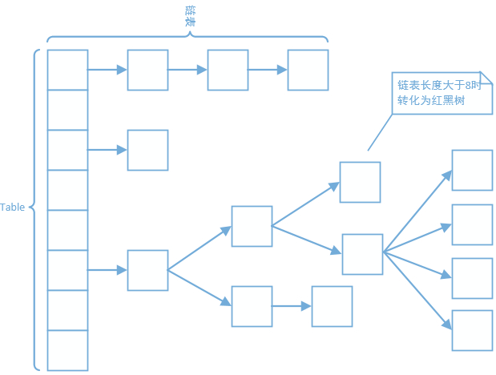

# HashMap的链表超过8就转为红黑树吗?

2020-10-09 17:16:32

## 抛出问题

最近看了一些有关`HashMap`的博客，似乎一提到链表转红黑树，统一的答案都是：链表长度超过8就转，那这个答案是对的吗？下面通过代码实例简单说说这个问题。

如果想了解更多HashMap的细节，推荐下面的博客：

- [Java-HashMap工作原理及实现](https://yikun.github.io/2015/04/01/Java-HashMap工作原理及实现/)
- 美团 ~ [java-hashmap](https://tech.meituan.com/2016/06/24/java-hashmap.html)

## 内部结构

参考一下，下面的图片有个直观的感受




## 源码层面

先看一下 HashMap 的 treeifyBin() 方法：

```java
/**
 * Replaces all linked nodes in bin at index for given hash unless
 * table is too small, in which case resizes instead.
 */
final void treeifyBin(Node<K,V>[] tab, int hash) {
    int n, index; Node<K,V> e;
    if (tab == null || (n = tab.length) < MIN_TREEIFY_CAPACITY)
        resize();
    // bala bala 已经省略
}
```

该方法中`MIN_TREEIFY_CAPACITY` 是这么定义的： `static final int MIN_TREEIFY_CAPACITY = 64;`， 所以在做链表转树的时候，还会判断node数组的长度是否`<`64，如果小于则resize，也就是扩容 * 2。

## 代码示例

我们从以下几个步骤出发，验证是否真的长度超过8的链表会转为红黑树：

1. 定义一个类作为HashMap的`key`;
2. 该类的每个对象的hashCode都是一致的，这里我们始终返回`1`，为了模拟冲突
3. 通过反射获取到`table`，也就是HashMap内部存储`<key,value>`的Node数组
4. 逐个遍历Node，若有冲突，则获取当前冲突节点的next节点
5. 若是已经转为红黑树，我们直接打印其类型，作为确认

```java
package com.amos.collection;

import java.io.Serializable;
import java.lang.reflect.Field;
import java.util.HashMap;
import java.util.Map;

public class HashMapTest implements Serializable {

    private static final long serialVersionUID = 7412605125132816598L;

    public static void main(String[] args) throws IllegalAccessException, NoSuchFieldException {

        Map<Key, Integer> map = new HashMap<>(16);

        // 制造冲突， 使得某个索引处节点个数 = 8
        for (int i = 0; i < 8; i++) {
            map.put(new Key(i), i);
        }

        Class<? extends Map> mapClass = map.getClass();
        Field table = mapClass.getDeclaredField("table");
        table.setAccessible(true);
        Object[] objects = (Object[]) table.get(map);
        System.out.println("table size=" + objects.length);
        int index = 0;
        for (Object o : objects) {
            System.out.print("index: " + index++ + "; ");
            printNext(o);
        }
        System.out.println("如果size不足64，则增加新的一个元素之后, 必定触发resize(), 容量 * 2");
        // 将桶里面的元素 + 1 ，以前是8 现在是9
        map.put(new Key(8), 8);

        index = 0;
        objects = (Object[]) table.get(map);
        System.out.println("table size=" + objects.length);
        for (Object o : objects) {
            if (o != null) {
                // 判断 table 内存储的到底是TreeNode 还是 Node
                if ("Node".equals(o.getClass().getSimpleName())) {
                    System.out.print("index: " + index + "; ");
                    printNext(o);
                } else {
                    System.out.println(o.getClass().getSimpleName());
                }
            }
            index++;
        }
    }

    /**
     * 打印node以及node所有下一个 node
     *
     * @param node
     */
    private static void printNext(Object node) throws NoSuchFieldException, IllegalAccessException {
        if (node == null) {
            System.out.println("当前节点为null");
        } else {
            System.out.println(node);
            Field next = node.getClass().getDeclaredField("next");
            next.setAccessible(true);
            // 循环打印next节点
            printNext(next.get(node));
        }
    }

    public static class Key {
        private Integer value;

        public Key(Integer value) {
            this.value = value;
        }

        public Integer getValue() {
            return value;
        }

        public void setValue(Integer value) {
            this.value = value;
        }

        @Override
        public boolean equals(Object o) {
            if (this == o) return true;
            if (!(o instanceof Key)) return false;

            Key key = (Key) o;

            return getValue() != null ? getValue().equals(key.getValue()) : key.getValue() == null;
        }

        @Override
        public int hashCode() {
//            return getValue() != null ? getValue().hashCode() : 0;
            return 1;
        }
    }
}

```

打印结果为：（省略一部分不重要的）

```
table size=16
index: 0; 当前节点为null
index: 1; com.amos.collection.HashMapTest$Key@1=0
com.amos.collection.HashMapTest$Key@1=1
com.amos.collection.HashMapTest$Key@1=2
com.amos.collection.HashMapTest$Key@1=3
com.amos.collection.HashMapTest$Key@1=4
com.amos.collection.HashMapTest$Key@1=5
com.amos.collection.HashMapTest$Key@1=6
com.amos.collection.HashMapTest$Key@1=7
当前节点为null
index: 2; 当前节点为null
… 省略的内容
如果size不足64，则增加新的一个元素之后, 必定触发resize(), 容量 * 2
table size=32
index: 1; com.amos.collection.HashMapTest$Key@1=0
com.amos.collection.HashMapTest$Key@1=1
com.amos.collection.HashMapTest$Key@1=2
com.amos.collection.HashMapTest$Key@1=3
com.amos.collection.HashMapTest$Key@1=4
com.amos.collection.HashMapTest$Key@1=5
com.amos.collection.HashMapTest$Key@1=6
com.amos.collection.HashMapTest$Key@1=7
com.amos.collection.HashMapTest$Key@1=8
当前节点为null
```

从上述打印内容可以看出，实际上当`table size=16`的时候，并且某个Node因为冲突而导致链表长度=8，再次插入到该链表处使冲突+1，并未转为红黑树。

为了使得链表转为红黑树，我们可以在初始化的时候，给HashMap的长度赋值为64，也就是修改为:

```
Map<Key, Integer> map = new HashMap<>(64);
```

然后再执行代码，结果如下：

```
table size=64
index: 0; 当前节点为null
index: 1; com.amos.collection.HashMapTest$Key@1=0
com.amos.collection.HashMapTest$Key@1=1
com.amos.collection.HashMapTest$Key@1=2
com.amos.collection.HashMapTest$Key@1=3
com.amos.collection.HashMapTest$Key@1=4
com.amos.collection.HashMapTest$Key@1=5
com.amos.collection.HashMapTest$Key@1=6
com.amos.collection.HashMapTest$Key@1=7
当前节点为null
index: 2; 当前节点为null
… 省略的内容
如果size不足64，则增加新的一个元素之后, 必定触发resize(), 容量 * 2
table size=64
TreeNode
```

从上述打印内容可以看出，因为`table size=64`满足了转为红黑树的条件：

1. 当前HashMap的size>=64
2. 某一个节点冲突导致链表长度>8

以上。


————————————————
版权声明：本文为CSDN博主「吃菜不吃饭」的原创文章，遵循CC 4.0 BY-SA版权协议，转载请附上原文出处链接及本声明。
原文链接：https://blog.csdn.net/amoscn/article/details/108982531