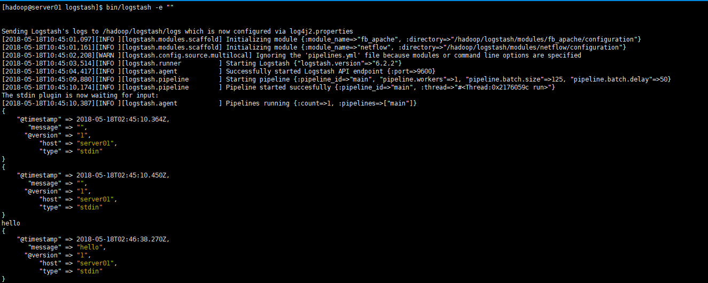
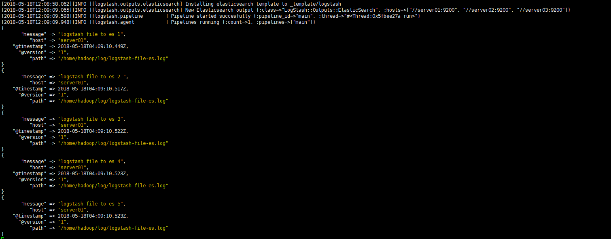
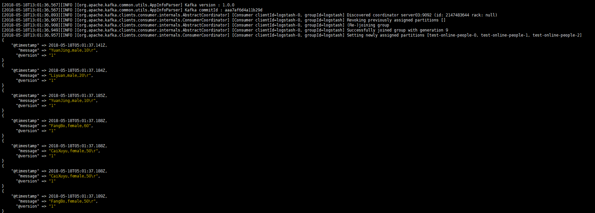

# Logstash的简单使用

[张行之](https://me.csdn.net/qq_33689414) 2018-05-18 15:24:12 

### Logstash的简单使用

#### Logstash安装

1. 下载

官方网站下载页面：

> https://www.elastic.co/cn/downloads/logstash

这里使用的是`logstash6.2.2`版本

1. 解压

上传到server01机器

> scp logstash-6.2.2.tar.gz hadoop@server01:/hadoop

解压即是安装

> tar -zxvf logstash-6.2.2.tar.gz

修改logstash目录

> mv logstash-6.2.2 logstash

1. 测试

进入到logstash目录下，执行下面语句：

```
bin/logstash -e ""1
```



或者

```
bin/logstash -e "input{stdin{}} output{stdout{}}"1
```


#### Logstash的简单原理

Logstash是使用管道方式进行日志的搜集处理和输出。

在logstash中，包括了三个阶段:
**输入input –> 处理filter（不是必须的） –> 输出output**


每个阶段都由很多的插件配合工作，比如file、elasticsearch、redis、kafka等等。

每个阶段也可以指定多种方式，比如输出既可以输出到elasticsearch中，也可以指定到stdout在控制台打印。

#### 命令行参数

-f：通过这个命令可以指定Logstash的配置文件，根据配置文件配置logstash

```
# 样式如：
# xxx.conf配置信息的文件
logstash -f xxx.conf
```

-e：后面跟着字符串，该字符串可以被当做logstash的配置（如果是”“，则默认使用stdin作为输入，stdout作为输出）

-l：日志输出的地址（默认就是stdout直接在控制台中输出）

-t：测试配置文件是否正确，然后退出。

#### 示例1：读取log日志，输出到控制台

`logstash-file-stdout.conf`文件内容：

```
input{
    file{
        path => "/home/hadoop/log/logstash-file-stdout.log"
        start_position => "beginning"
    }
}

filter{

}

output{
    stdout{
        codec => rubydebug
    }
}
```

执行`logstash-file-stdout.conf`文件，该文件放入`logstash/config`目录下。

```
./bin/logstash -f config/logstash-file-stdout.conf1
```

结果如图：


这里只是使用最简单的file配置，其中`path`是必须要指定。`start_position`默认是`end`，这里设置`beginning`表示从头开始读取。

具体file的参数设置，可参考[官方文档：File input Plugin](https://www.elastic.co/guide/en/logstash/current/plugins-inputs-file.html)

logstash读取完成后，下次不会再读取的。

#### 示例2：读取log日志到kafka

1. 编写`logstash-file-kafka.conf`文件，内容如下：

```
input{
    file{
        path => "/home/hadoop/log/logstash-file-kafka.log"
        start_position => "beginning"
    }
}

filter{

}

output{
    kafka{
        topic_id => "logstash-file-kafka"
        bootstrap_servers => "server01:9092,server02:9092,server03:9092"
    }
}
```

关于kafka的output的插件，详情可阅读[官网：Kafka output plugin](https://www.elastic.co/guide/en/logstash/current/plugins-outputs-kafka.html)

1. 启动zookeeper、kafka集群

zk集群启动，在server01，server02，server03机器上分别执行：

```
zkServer.sh start1
```

启动kafka集群：

```
cd /hadoop/kafka

./bin/kafka-server-start.sh -daemon ./config/server.properties123
```

1. 创建kafka的topic主题

```
cd /hadoop/kafka

./bin/kafka-topics.sh --create --zookeeper server01:2181,server02:2181,server03:2181 --replication-factor 2 --partitions 2 --topic logstash-file-kafka123
```

1. 执行logstash读取日志命令

```
cd /hadoop/logstash

./bin/logstash -f config/logstash-file-kafka.conf123
```

1. 开始kafka的消费shell命令

```
cd /hadoop/kafka

./bin/kafka-console-consumer.sh --zookeeper server01:2181,server02:2181,server03:2181 --from-beginning --topic logstash-file-kafka123
```


#### 示例3：log日志分别输出到Elasticsearch和控制台

1. 编辑`logstash-file-es.conf`文件

```
input{
    file{
        path => "/home/hadoop/log/logstash-file-es.log"
        start_position => "beginning"
    }
}

filter{

}

output{
    elasticsearch {
      index => "flow-%{+YYYY.MM.dd}"
      hosts => ["server01:9200", "server02:9200", "server03:9200"]
    }

    stdout{
        codec => rubydebug
    }
}
```

1. 启动elasticsearch集群

在server01，server02，server03机器上分别启动elasticsearch程序

```
cd /hadoop/elasticsearch

# -d表示在后台启动
./bin/elasticsearch -d
```

1. 执行logstash读取日志文件命令

```
cd /hadoop/logstash

./bin/logstash -f config/logstash-file-es.conf
```

结果：




#### 示例4：logstash从kafka中读取数据到Elasticsearch中

1. 编辑`logstash-kafka-es.conf`文件

```
input{
    kafka{
        topics => ["test-online-people"]
        bootstrap_servers => "server01:9092,server02:9092,server03:9092"
  }
}

filter{

}

output{
    elasticsearch {
        index => "kafka-%{+YYYY.MM.dd}"
        hosts => ["server01:9200", "server02:9200", "server03:9200"]
    }

    stdout{
        codec => rubydebug
    }
}
```

1. 关于启动kafka和elasticsearch集群，参考上面相关示例

略

1. 执行logstash的配置文件

```
cd /hadoop/logstash

./bin/logstash -f config/logstash-kafka-es.conf
```





https://blog.csdn.net/qq_33689414/article/details/80365029