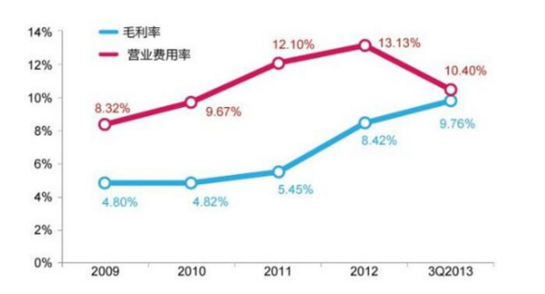

# 如何计算毛利额和毛利率？

毛利额与毛利率的区别是什么？

推荐于2019-10-29

关注

**计算：**

1. 毛利率=毛利/营业收入×100%=（主营业务收入-主营业务成本）/主营业务收入×100%。
2. 毛利额=销售收入净额-销售成本。

**区别：**

毛利额是一个数字，毛利率是一个百分比。

**毛利率定义：**

毛利率是毛利与销售收入的百分比，其中毛利是收入和与收入相对应的营业成本之间的差额，用公式表示：毛利率=毛利/营业收入×100%=（主营业务收入-主营业务成本）/主营业务收入×100%。

**毛利额定义：**

当一个商品有销售时，销售毛利额就是移动平均成本和售价之间的差异，毛利额=销售收入净额-销售成本。

**扩展资料：毛利率分类**

1. 按商品大类分：单项商品毛利率、大类商品毛利率、综合商品毛利率
2. 按行业分：工业企业的产品销售毛利率、商业企业的商品销售毛利率、建造施工企业毛利率、交通运输业毛利率、旅游饮食服务业毛利率
3. 按区域划分：区域销售毛利率、按项目划分的项目毛利率

**扩展链接：[百度百科-毛利率](https://baike.baidu.com/item/毛利率/90583?fr=aladdin)**

https://zhidao.baidu.com/question/557800839.html